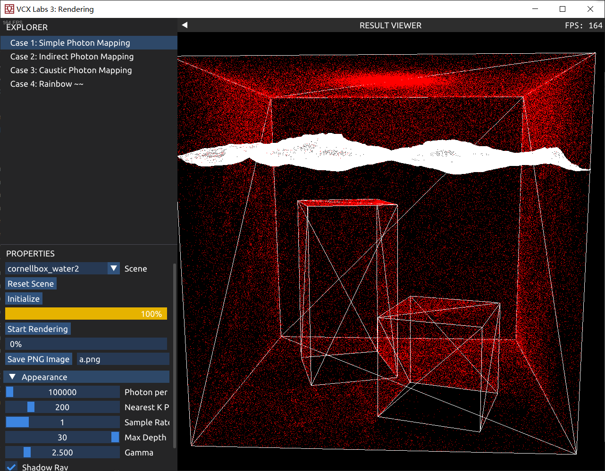

# Photon Mapping 大作业报告

Photon Mapping (光子映射) 算法是一种全局光照渲染算法，能够处理Path Trace (路径追踪) 算法难以处理的焦散现象，比如光线透过水面在水底产生的明暗条纹。

> 焦散：任何从光源经过反射或折射，到漫反射表面，再到眼睛(或摄影机)的光照贡献。

本项目基于VCX lab框架，通过路径追踪算法实现了直接光照渲染，通过光子映射实现了间接漫反射渲染，焦散现象的渲染，并对光子实现了可视化。此外，还尝试渲染了光束通过棱镜的散射现象。

## 算法亮点

1. 实现出比较好的水面焦散效果
2. 使用了kdTree，BVH数据结构进行加速
3. 实现了光子贴图的可视化
4. 尝试了色散现象

## 实现思路

光子映射算法分为两个阶段：1. 创建光子贴图；2. 路径追踪收集光子

### 阶段一：创建光子贴图

创建光子贴图时，从光源发出光子，当光子碰撞到场景中的物体并且满足指定条件时，记录该光子的位置和状态，以便阶段二中收集。

假设光源的功率为$\Phi$，光源为一个曲面$D$，面积为$A$。设$\vec x$为光源上一点，$\vec n$为该位置的法向量，$\omega$为该位置出发的一个立体角，$\Omega$为该位置的所有立体角构成的半球空间，$L_e$为该位置该立体角的辐亮度
$$
\Phi = \int_{D}d\vec x\int_{\Omega}L_e d\omega
$$

#### 1.1 光源采样

现在需要对光源发出光子进行采样，根据蒙特卡洛积分法可以得到：
$$
\Phi\approx \sum_i \frac 1 N\frac {{L_e}_i\cos\theta_i} {\text{pdf}_{D}(\vec x)\text{pdf}_\Omega(\omega)}
$$
每一个求和项即为一个光子的初始功率。

对于点光源，辐亮度由功率向所有方向平分$L_e = \frac \Phi {4\pi}$，没有角度$\cos\theta=1$，采样为随机选择方向$\text{pdf}_D(\vec x)=1, \text{pdf}_\Omega(\omega)=\frac 1 {4\pi}$，则光子功率为$\Phi / N$

对于面光源，辐亮度与立体角到法向量的角度$\theta$有关，$L_e=\frac \Phi A \frac {\cos \theta} {\pi}$可是得原积分式成立。采样时使用表面随机选择位置，方向使用半球权重采样，$\text{pdf}_D(\vec x)=\frac 1 A, \text{pdf}_\Omega(\omega)=\frac {\cos \theta} {\pi}$，则光子功率为$\Phi / N$


该步骤在```PhotonMapping.cpp: GeneratePhoton()```中实现

#### 1.2 光子在环境中反射

光子被发出后，将不断在环境中反射，首先使用在lab 3中实现的BVH来寻找光子与三角面的交点，并读取材质。然后使用材质的BSDF数据生成反射方向以及反射后功率。

实现时，材质由mtl文件指定，mtl中通过```illum```指定该三角面的类型：使用Phong模型的漫反射，理想全反射，理想折射。

如果是**漫反射**，则均匀地随机生成半球方向作为反射方向，再根据该反射方向，通过Bling-Phong模型计算反射的能量。由于采样的概率密度为$\frac 1 {2\pi}$，而漫反射权重$\cos \theta$在BSDF中的表示，需确保$\int_\Omega f(\omega)d\omega=1$，则$f(\omega)=\frac {\cos\theta} {\pi}$，则最终光子反射功率变化比例即为$\frac {\cos \theta} {\pi} / \frac 1 {2\pi}=2\cos\theta$

如果是**全反射**，则直接计算反射方向即可。

如果为**折射**，使用schlick估计计算折射与反射的概率，以确保在光线与反射平面接近时，能够实现全反射，且分界线不会特别明显。

以上部分实现在```Intersecter.cpp: DirectionFromBSDF()```中

光子在环境中每经过一次反射，使用俄罗斯轮盘赌（即随机一个固定概率，比如0.7）继续反射，否则就直接停止。

#### 1.3 记录光子贴图

本项目中使用了两个光子贴图：全局光子贴图，焦散光子贴图。根据光子贴图的功能，使采样的光子在环境中不断反射，达到指定条件时，记录其位置、到达方向、功率。

在阶段二路线追踪时，只有到漫反射表面才会使用光子映射，其余部分都是用路径追踪算法。所以光子仅在碰到漫反射表面时记录。

对于全局光子贴图，光子在经过一次漫反射之后（即第二次及以后）到达漫反射表面，才会记录到光子贴图中。

对于焦散光子贴图，光子在经过至少一次全反射、折射之后，碰到漫反射表面，则记录到贴图中，并且立即停止反射。

下图中，标为c (caustic)为焦散光子，g (global) 为全局光子


完成记录光子后，建立kDTree数据结构，加速在阶段二中对光子的查找。

该部分代码实现在```PhotonMapping.cpp: InitScene```中

### 阶段二：路径追踪渲染

渲染方程为：
$$
L_r(x,\omega)=\int_\Omega f(x,\omega',\omega)L_i(x,\omega')\cos \theta' d\omega'
$$
其中$f$为BSDF函数，$L_i$为入射光线辐照度，$L_r(x,\omega)$为出射光线（指向摄像机）


#### 2.1 光子密度估计

由于光子携带的是功率$\Phi$不是辐亮度$L_i$，则需对方程进行一些变换
$$
L_i(x,\omega')=\frac {d^2\Phi} {dA\ \cos\theta'\ d\omega'}\\
L_r(x,\omega)=\int_\Omega f(x,\omega',\omega)\frac {d^2\Phi} {dA\ \cos\theta'\ d\omega'}\cos \theta' d\omega'\\
=\int_\Omega f(x,\omega',\omega)\frac {d^2\Phi} {dA\ }(\omega')
$$
则我们需要得到位置$x$所在的一小片区域，从各个方向来的功率乘以该方向的BSDF函数$f(x,\omega',\omega)$后，除以这一小片区域的面积。而从某个方向来的功率，正好是光子所记录的。

于是，可以收集该位置附近的$N$个光子，计算功率乘以BSDF的和，再除以这一片区域面积。面积采用估计的方法，找到最远的光子，到$x$的距离为$r$，使用$\pi r^2$作为面积的估计。

#### 2.2 渲染过程

首先从相机的每个像素发射光线，通过BVH计算与场景的交点，如果交点为镜面反射或折射，则继续，直到碰到了漫反射表面时，停止反射，做进一步处理。

首先计算该位置的**直接光照**，从该位置向每一个光源发射光线，判断是否被物体挡住，计算出该点的亮度。（对于平面光源，则随机采样选择一个位置）

接着计算**焦散光照**，从焦散光子图中，找到最近的若干个光子（使用k-Dtree数据结构），通过Bling-Phong模型得到光子对视线反射的能量，再除以$\pi r^2$得到密度估计。

计算**间接漫反射**，从全局光子图读取，步骤同上。

该部分代码实现在每一个Case的```RayTrace()```函数

**小优化**：对于焦散光子图，在一些场景中，焦散光子只在特定的位置存在，对于焦散光子特别稀少的区域，寻找最近光子都比较远，在k-Dtree中查找速度非常慢。为此设置一个查找光子的最远距离，超过该距离的光子不再寻找，大幅提高了算法效率。

### 色散现象

对色散现象的视线做了一次失败的尝试

色散现象是由于不同波长的光通过玻璃的折射率不同，红色比较小，而蓝色比较大

对焦散光子图，考虑从光源分别发出三种颜色(RGB)的光子进行采样，在折射时分别使用不同的折射率进行折射

## 功能解释

### Case栏

本项目实现了4个Case

Case 1为仅使用全局光子贴图的渲染，并且在全局光子图中包含了只有一次漫反射的光子当作直接光照。

Case 2为分离了直接光照的渲染，全局光子图中不包含只有一次漫反射的光子

Case 3为相比于前一个增加了焦散光子图，效果最好的一个Case

Case 4尝试渲染三棱镜的色散效果

### 选项栏

     

在左侧选项栏中，可以选择场景。

按钮```Initialize```进行初始化，此时下面进度条会显示生成光子的进度，生成完毕后，会在场景中将光子可视化，其中红色为全局光子图，绿色为焦散光子图。

在Case 3中，进度条将会跑两遍，第一次为全局光子图，第二次为焦散光子图。

点击```Start Rendering```开始渲染

下面的滑动条可以设置各项数据，分别为：

1. 全局光子图每个光源生成光子数
2. 焦散光子图每个光源生成光子数
3. 焦散光子图寻找邻近光子的最大距离 (根据模型的数量级调整)
4. 全局光子图寻找邻近光子数
5. 焦散光子图寻找邻近光子数
6. 采样率
7. 路径追踪最大深度
8. 伽马校正系数
9. 是否启用直接光照阴影

## 编译即运行环境

完全使用VCX lab 3的编译即运行环境，可直接使用xmake进行编译和运行。

## 效果展示

以下结果均在5分钟内渲染完成

### 水下焦散

Sample Rate: 4 ；全局光子:10000，邻近: 200；焦散光子：6331473，邻近: 50


下两图分别为全局光子可视化图和全局光子渲染结果

    

### 镜面

Sample Rate: 5 ；全局光子:10000，邻近: 200；焦散光子：5737723，邻近: 50

可以观察到天花板上的光亮为镜面反射的结果


以下分别为光子可视化图，全局光子渲染图

     

### 金属球和玻璃球

Sample Rate: 4 ；全局光子:10000，邻近: 200；焦散光子：6331473，邻近: 50

可以观察到玻璃球下面光斑为玻璃球聚光效果，右侧墙上的光斑为光线经过金属球反射再进入玻璃球的结果


光子可视化图：


### 三棱镜色散

