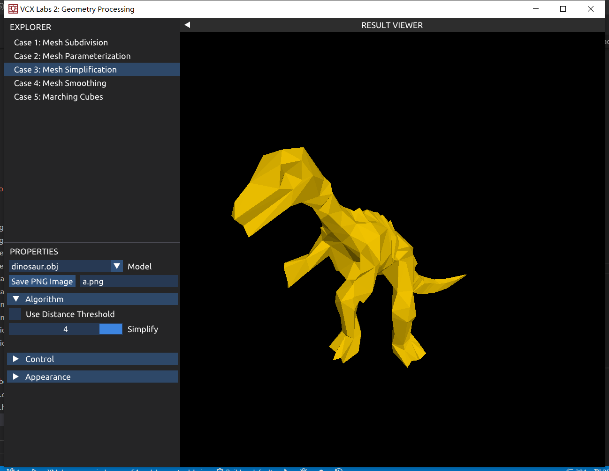

# VCX-lab2 报告

## Task 1: Loop Mesh Subdivision

该lab里仅针对封闭的三维几何体进行模型细分。

#### 实现思路

##### (1) 计算新增点坐标


对于每一条边，需要按照如上图左的比例，增加一个新的顶点。

实现时，利用提供的```DCEL```数据结构，枚举每一条边，获取该边的两个三角面，将两个三角面的顶点相加，再加上该边的两个顶点，最后除以8，即可得到新点的坐标。
$$
(V_0+V_1+V_2)+(V_3+V_1+V_2)+(V_1+V_2) = \frac 1 8 V_0+\frac 3 8 V_1 + \frac 3 8 V_2+ \frac 1 8 V_3
$$
直接将新点加入```SurfaceMesh```中，使用一个```unordered_map```来保存边到该点的映射关系。

由于```DCEL```中包含一条边的两个方向，为了防止重复增加点，需要使用```unordered_map```来判断一下该点是否已被添加。

##### (2) 修改旧顶点坐标

对于旧顶点，需要按照上图右的比例，修改。

实现时，使用顶点坐标数组```sum```存储每个旧顶点周围的新顶点坐标和，```deg```数组存储该顶点的度数。该步骤可以在计算新增点坐标时更新完成。

然后，更新旧顶点坐标，使用如下公式即可（其中u按照图中公式计算）。
$$
V_i = (1-u\ \text{deg}[i])V_i+u\ \text{sum}[i]
$$

##### (3) 连接新顶点，设置Indices

使用```DCEL```数据结构枚举每一个旧的三角面，通过```unordered_map```获取他每条边上新增点的编号，得到下图。


向```SurfaceMesh```的```Indices```添加序列$v_0e_2e_1,v_1e_0e_2,v_2e_1e_0,e_0e_1e_2$即可


重复以上步骤```numIteration```次

#### 注意事项

在```DCEL```的实现中，使用了```unordered_map```，且用的hash值类型为```std::size_t```，在计算hash过程中，使用了左移32位的操作。

在32位系统下，```std::size_t```为32位的，左移32位操作会出现溢出，导致hash出错，bug极难察觉。

#### 效果


## Task 2: Spring-Mass Mesh Parameterization

根据算法推导，最终希望得到满足如下条件的顶点UV坐标 $t$. 且边界上的点在正方形$[0,1]^2$的边界上平均分配
$$
t_i=\sum_{j\in N_i}\lambda_{ij}t_j
$$
$N_i$为结点$i$的邻居集合；对于系数$\lambda_{ij}$，简单地选择$\lambda_{ij}=\frac 1 {|N_i|}$

#### 实现思路

首先通过```DCEL```，找到一个在边界上的顶点。通过```DCEL```，将整个边界上的一圈顶点按顺序存储在数组```side_v```中

将```side_v```中的点分成4段，每一段将其材质UV均匀的放在正方形的一条边上

迭代```numIterations```次，每次枚举所有顶点，通过以下公式更新该顶点的UV坐标
$$
t_i=\frac 1 {|N_i|}\sum_{j\in N_i}t_j
$$
经过许多次迭代，更新的幅度会越来越小，趋于稳定。

#### 效果


## Task 3: Mesh Simplification

使用Quadric Error Metric进行模型简化，根据要求，使用迭代的方式删点，没有在缩边后更新维护周围结点的Q值

#### 实现过程

1. **计算每一个点的Q矩阵：**

   1. 通过DCEL枚举点相邻的面，计算面的法向量$n$, 在平面上任取一点$a$，将法向量齐次化$\bar n=(n,-n\cdot a)$，则$Q=n^{\top}n$, 为$4\times 4$的矩阵。
   2. 将相邻的面Q矩阵相加得到点的Q矩阵

2. **寻找合法的点对，并计算他们的误差值Quadric Error Metric：**

   1. 首先必须定义合法的模型。

      在该lab的代码中，认为一个合法的模型，每一条边最多同时存在于2个三角面上，仅在边界上存在于一个三角面。**（区别）**认为如果一个点连接了2个以上的边界边也视为合法。即下图中左为合法，右为非法（红色为同一条边的第三个三角形）

      

   2. 由此可以定义出可坍缩的点对：

      对于点对$(u,v)$，若存在任意点$w$，使得边$(u,w),\ (v,w)$存在，且$(u,v,w)$不是网格模型上的三角面，则该点对不可坍缩，其余的均可坍缩。

      下图显示了一个非法点对$(u,v)$和使其非法的点$w$

      

      根据论文描述，点对除了满足以上条件，还要满足以下条件任意一条即为可坍缩的

      1. $(u,v)$存在边
      2. $||u-v||<t$，（即$u$和$v$距离小于某一个阈值）

   3. 对于合法的点对，计算他们坍缩后的点$\bar v$位置，计算他们的误差值，使用论文中的公式计算
      $$
      \bar Q=Q_1+Q_2\\
      Q=\left[\begin{matrix}
      q_{11} & q_{12} & q_{13} & q_{14} \\
      q_{21} & q_{22} & q_{23} & q_{24} \\
      q_{31} & q_{32} & q_{33} & q_{34} \\
      q_{41} & q_{42} & q_{43} & q_{44} \\
      \end{matrix}\right]\\
      \bar v=\left[\begin{matrix}
      q_{11} & q_{12} & q_{13} & q_{14} \\
      q_{21} & q_{22} & q_{23} & q_{24} \\
      q_{31} & q_{32} & q_{33} & q_{34} \\
      0&0&0&1 \\
      \end{matrix}\right]^{-1}
      \left[\begin{matrix}
      0\\
      0\\
      0\\
      1
      \end{matrix}\right]
      $$
      若上述矩阵不可逆，则直接选取$\bar v = (v_1+v_2)/2$

      误差值$\text{error}=\bar v^{\top}Q\bar v$

   4. 将上述点对以及他们的误差值放入最小优先队列中

3. **从优先队列中取出点对坍缩，直到优先队列为空或剩余点数达到要求**

   首先从优先队列中取出误差值最小的点对，判断该点对的两个点是否已经被删掉

   如果没有被删掉，需要**再次**使用步骤2中的方法**判断该点对是否可坍缩**。因为在其他点被坍缩后，可能使得该点对不再合法。

   坍缩u,v两个点，使用数组```delv```标记其被删除，在```mesh.Positions```中添加新点，使用```newid```数组记录u,v两个点坍缩后的新点编号。

4. **重新构建所有三角面**

   此时优先队列已经为空，或者剩余点数达到要求。

   删除原来```mesh.Indices```数组，重新构建三角面。

   通过DCEL枚举所有三角面，使用```newid```找到新的三角面的三个点，若三个点互不相同，则将这个新的三角面加入```mesh.Indices```

5. **从```mesh.Positions```中删除已经被坍缩的点**

   删除里面的点，并将后面的点前移，同步修改```mesh.Indices```中的编号。

6. **若剩余点数不符合要求，重复步骤1~5**

#### 效果



## Task 2: Mesh Smoothing

实现Laplacian smoothing, 分别使用Uniform weight和Cotangent Weight. 

#### 实现过程

算法过程中需要枚举某个点的邻居顶点，并且获取他们的边信息。但由于该lab中没有提供访问某顶点的邻接边的API，使用另一种实现方式。

使用一个数组```newv```维护每个点对应新节点的加权坐标和，```weight```维护权重和

使用DCEL枚举模型中每一条边，计算该边的权重，若使用Uniform，则权重为1.

 若使用Cotangent，则通过DCEL访问该边所在两个面的对点u1, u2，用以下公式计算一个对点的cot值
$$
|\cot \theta| = \left|\frac {(u-v_1)\cdot(u-v_2)} {||(u-v_1)\cross (u-v_2)||}\right|
$$
将两个对点的cot值绝对值相加，得到该边的权重w

将该边的权重和两个点的带权坐标加到对应的数组上去。

最后，枚举每个点，$\bar v_i=v_i(1-\lambda)+\lambda\ \text{newv}[i]/\text{weight}[i]$

重复迭代以上步骤

#### 效果


