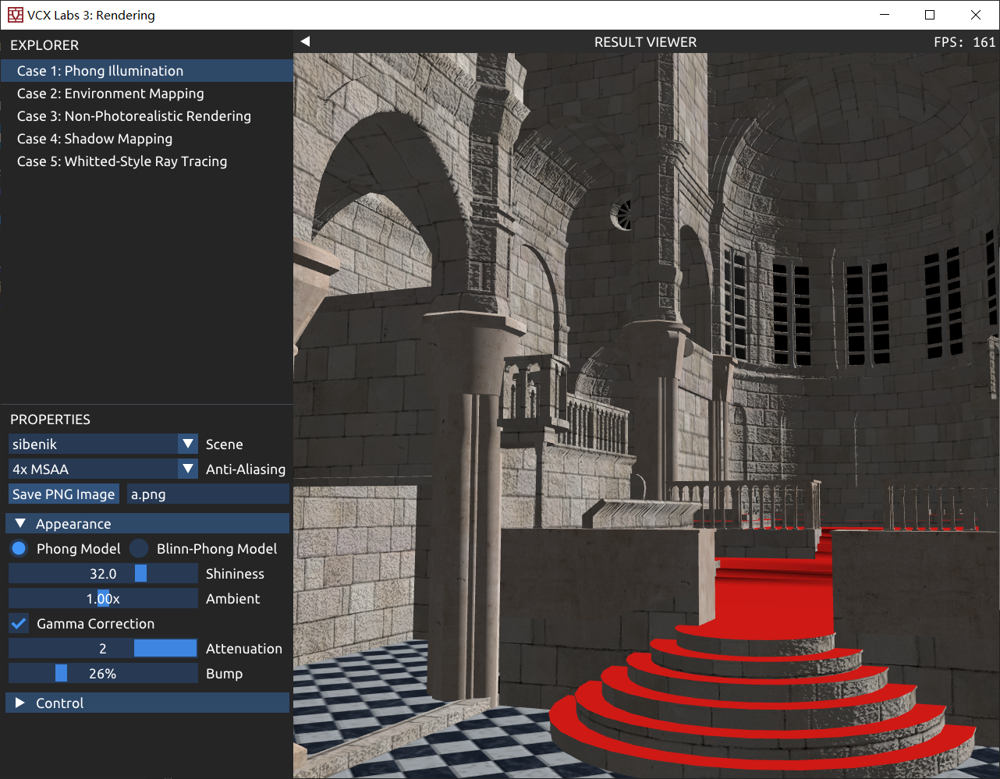
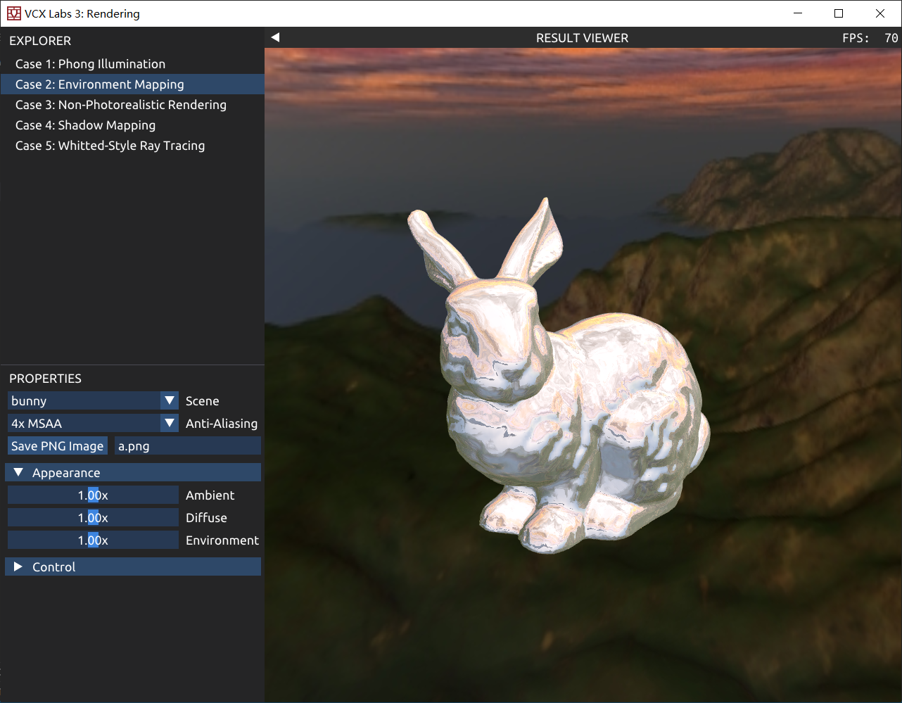
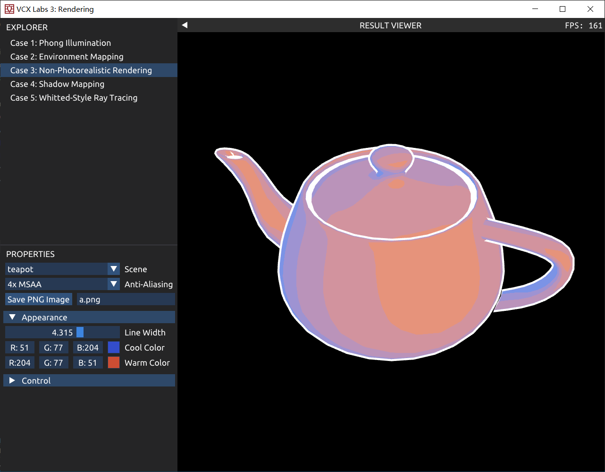
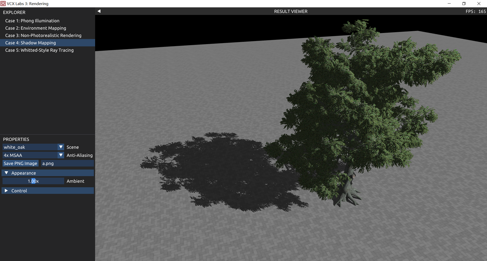
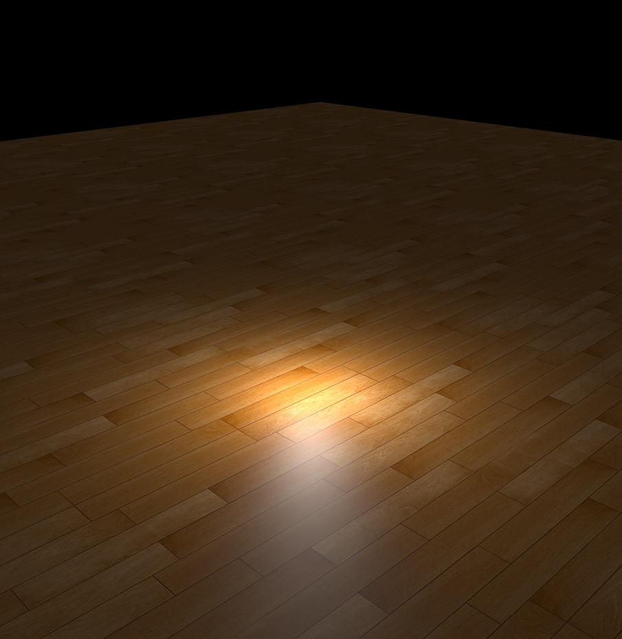
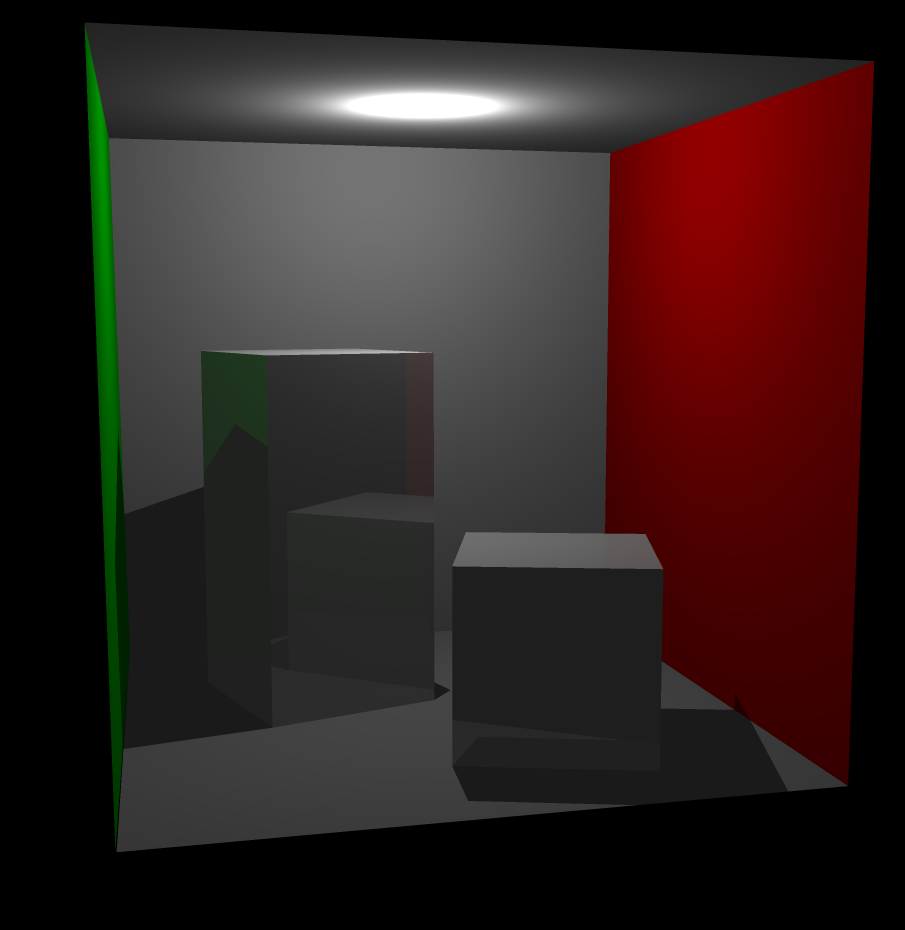
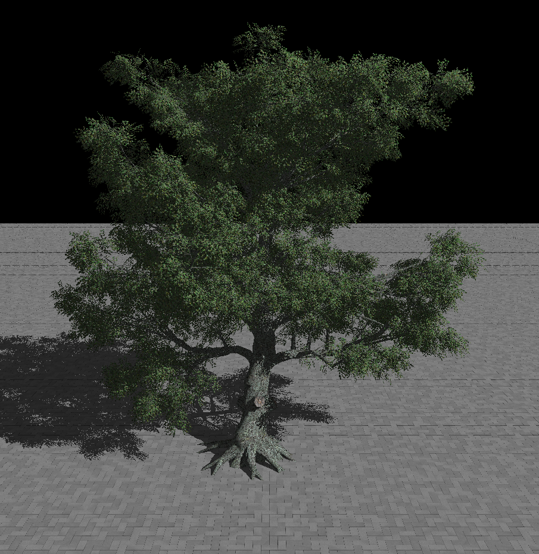
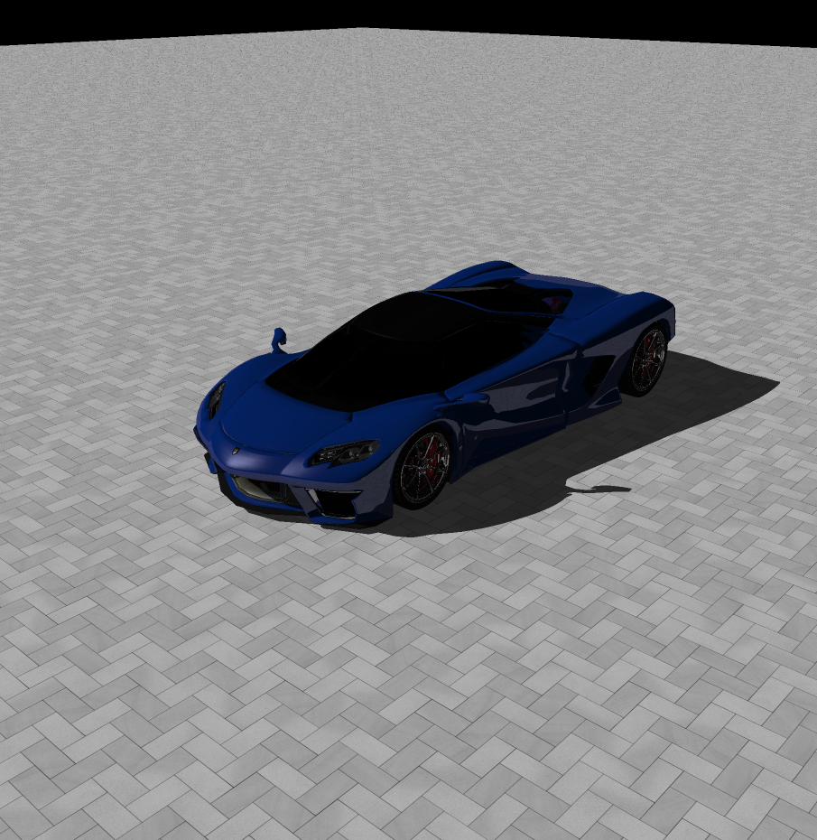
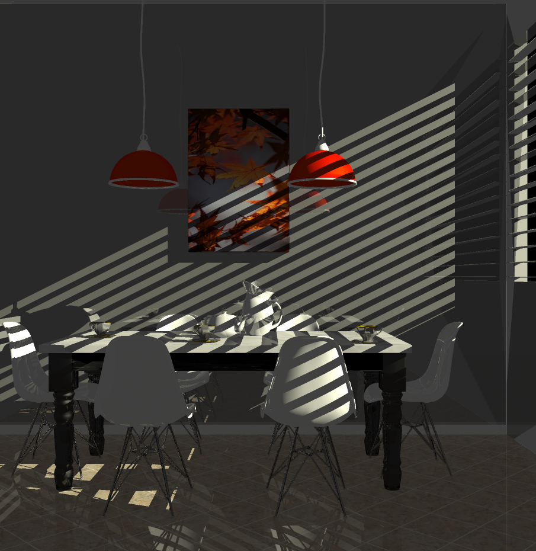
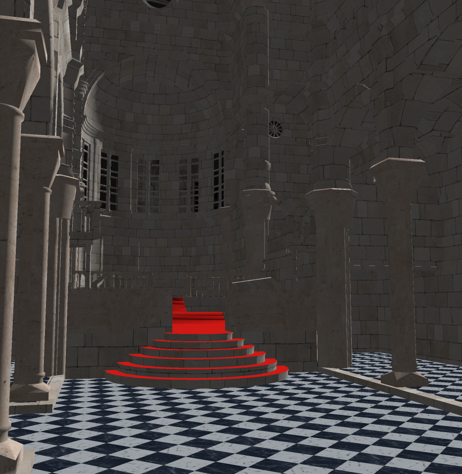

# VCX-lab3 报告

## Task 1: Phong Illumination

### 颜色计算

已知向量有```lightDir```: $l$，```normal```: $n$，```viewDir```: $v$

对于漫反射光照，只计算光线与法向的接近度$\cos \theta = n\cdot l$

对于高光，Phong需要计算反射光线

反射光线$R=\text{reflect}(-l,n)=2(n\cdot l)n-l$，高光的程度为反射光与视线接近度$\cos \alpha=v\cdot R$

Bling-Phong为了降低计算量，采用半程向量与法向量的接近度

半程向量$h=\text{normalize}(v+l)$，接近度$\cos \beta = h\cdot n$ （实际上$2\beta = \alpha$）

为了使得高光范围更小，用指数函数使其快速降低$(\cos \beta)^p$

最后乘以物体颜色和光照强度得到该点颜色

### 问题回答

1. 顶点着色器和片段着色器的关系是什么样的？顶点着色器中的输出变量是如何传递到片段着色器当中的？

   答：顶点着色器位于片段着色器之前。顶点着色器的输出（标记了```out```的变量）会对应片段着色器的输入```in```，使用```layout(location=x)```来进行一一对应。顶点着色器需要输出顶点的齐次坐标，经过硬件处理后，信息进入片段着色器，此时需要计算每个点的颜色。

2. 代码中的 `if (diffuseFactor.a < .2) discard;` 这行语句，作用是什么？为什么不能用 `if (diffuseFactor.a == 0.) discard;` 代替？

   在```phong.frag```并未处理存在透明纹理的情况下，背后的物体的光照情况。于是采用一种简单的方式，当不透明度很小时，忽略它的渲染来实现透明效果。对于一些纹理（比如树），只存在不透明度为0和1的情况，需要忽略为0的部分。但由于纹理被放大插值后，会出现许多介于0和1之间的值，如果判断==0来渲染，会多出许多不应该渲染的部分。

### Bump Normal

参考了toturial的网站的代码，修改了相关的变量名

### 效果



## Task 2: Environment Mapping

### 实现

在```skybox.vert```中，为```a_Position```乘上视角矩阵和投影矩阵。

由于原来的天空盒太小，于是给```a_Position```乘一个非常大的数，使其放大到大于任何模型。

取```.xyww```作为最终的```gl_Position```，使得其深度值永远为1，让其保持在最后。

在```envmap.frag```中，计算视角方向与法向的反射方向，通过反射方向读取天空盒材质即可。

### 效果



## Task 3: Non-Photorealistic Rendering

### 实现

计算光照方向与法向的cos值表示亮度，讲亮度在0~1里划分为n个等级，四舍五入的方法选择最近的等级，输出对应等级下，冷色和暖色的混合颜色。

由于观察到lab原来的代码实现后，描边效果仅在和背景交界处才出现。发现原因是在绘制背面（描边）时没有开启深度测试，之后绘制前面时把描边遮住了。于是修改代码在描边之前同样开启深度测试，达到了最终效果。

### 问题回答

1. 代码中是如何分别渲染模型的反面和正面的？（答案在 `Labs/3-Rendering/CaseNonPhoto.cpp` 中的 `OnRender()` 函数中）

   答：使用```glEnable(GL_CULL_FACE)```启用剔除正面/反面的功能，用```glCullFace(GL_FRONT)```剔除正面绘制反面，用```glCullFace(GL_FRONT)```剔除反面绘制正面

2. `npr-line.vert` 中为什么不简单将每个顶点在世界坐标中沿着法向移动一些距离来实现轮廓线的渲染？这样会导致什么问题？

   经试验，问题在于此时轮廓线会遵循进大远小的透视原则，不是我们想要的绘制风格。我们需要的风格是在任意大小下描边线条一致的风格，只能在变换到标准设备坐标之后进行移动。

### 效果



## Task 4: Shadow Mapping (3')

### 实现

对于平行光源阴影，只需令```closestDepth```为从深度纹理中读取对应位置即可

对于点光源阴影，考虑距离时并没有将坐标转换到标准设备坐标，但深度纹理中存储的深度是[0,1]的，则需乘以```u_FarPlane```来还原回原来的深度值

### 问题回答

1. 想要得到正确的深度，有向光源和点光源应该分别使用什么样的投影矩阵计算深度贴图？

   答：有向光源使用正交投影矩阵，点光源使用6个透视投影矩阵

2. 为什么 `phong-shadow.vert` 和 `phong-shadow.frag` 中没有计算像素深度，但是能够得到正确的深度值？

   通过将顶点坐标乘以光源视角投影矩阵，把每个顶点的坐标转换到以光源视角下的标准设备坐标，已经把每个位置的深度值计算出来了（即z坐标），在[-1,1]之间。

### 效果



## Task 5: Whitted-Style Ray Tracing

### 实现

#### 光线与三角形相交

设源点为$S$，光线方向$\vec d$，平面法向$\vec n$，三角形三点$p_1, p_2, p_3$

平面交点到源点$S$的距离
$$
t = \frac {(p_1-S)\cdot \vec n} {\vec d \cdot \vec n}
$$
令交点$I=(1-u-v)p_1+up_2+vp_3$

则
$$
u=\frac {(p_3-p_1)\cdot (\vec d \times (S-p_1))} {\vec d \cdot \vec n}\\
v=\frac {-(p_2-p_1)\cdot (\vec d \times (S-p_1))} {\vec d \cdot \vec n}
$$
判断$0<u<1$且$0<v<1$且$u+v<1$即可知道交点是否在三角形之内

#### 光线追踪部分

在```task.cpp```中，对```auto rayHit = intersector.IntersectRay(ray);```添加一个循环，判断其如果碰到了透明材质，将继续从碰撞位置继续发出光线。

对于结果```result```，初始设置为环境光照颜色，即```kd * ambient```

在shadow ray部分，如果启用阴影，则在碰撞点向光源发出光线，判断路上是否存在阻挡（非透明材质），如果存在阻挡，则把光强```attenuation```设置为0，实现阴影效果。对于点光源，需要判断碰撞点到出发点的距离是否大于到光源的距离；对于平行光源，必须要求完全无阻挡。

最终计算颜色时，使用Bling-Phong模型，计算光照到该点的漫反射，高光反射的效果，进行相加。

#### 求交加速（BVH）

对三角面（存储为model指针和indice指针）进行维护。

所有模型的三角面构成长为$n$一个序列。

对该序列中所有三角面求一个Bounding Box，选择最宽的一条轴。

使用```std::nth_element```使得序列中，按照最宽的一条轴排序后，中间第$n/2$大一定在正中间，且左边的都比它小，右边的比它大。

将左边的$n/2$个分给BVH树的左子节点，右边$n/2$个分给右子节点，每个结点存储能够包围他所拥有的所有三角面的Bounding Box

递归建树，直到叶子节点存储唯一一个三角面。

查询时，首先判断光线是否进入该结点的Bounding Box，如果会进入，再递归进入子树查询。

### 问题回答

1. 光线追踪和光栅化的渲染结果有何异同？如何理解这种结果？

   答：光线追踪算法能够更真实的模拟反射、折射（虽然没实现）等效果，因为光线追踪更真实的模拟了光线的物理路径。而光栅化很难模拟反射等效果，光栅化仅能得到视线到物体，物体到光源共两层计算，无法在反射更多层，故难以模拟反射效果。光线追踪需要更大的计算量，速度较慢。

### 效果

在windows x64 release模式下编译（开了优化）

floor (sample rate: 3; max depth: 5; time: 3s)



cornell box (sample rate: 3; max depth: 5; time: <30s)



white_oak (sample rate: 1; max depth: 3)



white_oak (sample rate: 3; max depth: 5; time: 12min)


sports_car (sample rate: 2; max depth: 3; time: 1min)



breakfast_room (sample rate: 2; max depth: 4; time: 13min) 



Sponza (sample rate: 2; max depth: 4; time: 13min) 


Sibenik (sample rate: 2; max depth: 3; time: 35min) (关闭shadow)

全封闭房间，不关shadow光源照不进来。。。。

