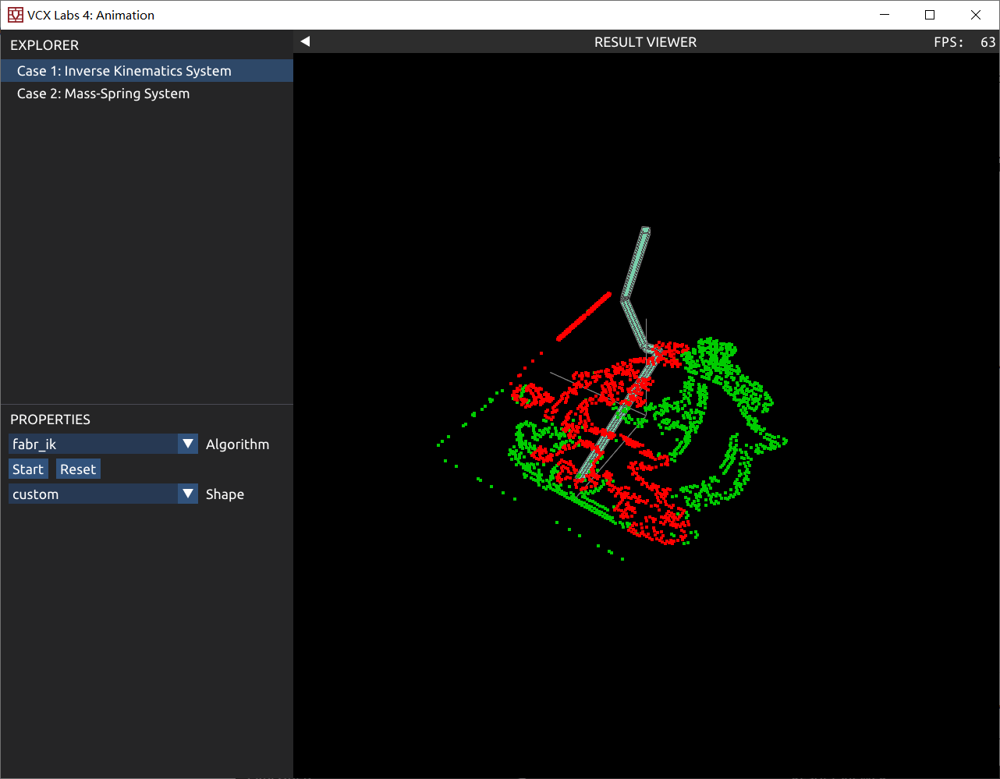

# VCX-lab4 报告

## Task 1: Inverse Kinematics

### 实现

#### subtask1

先计算每个关节的```GlobalRotation```（即前缀乘积）

然后将```GlobalRotation```转化为4*4矩阵，乘上```LocalOffset```得到该关节旋转后偏移量，加上一个关节的全局位置即可得到```GlobalPosition```

#### subtask2

从第n-2个关节开始，先计算该关节到机械臂末端的方向```orig```，在计算目标方向```dest```（该关节到```EndPosition```的方向），在```LocalRotation```左边乘上```orig```到```dest```的方向（代表叠加一个新的旋转，使之指向目标位置）。从该关节往后跑一下```ForwardKinematics```计算出每个点的全局位置。

#### subtask3

首先将机械臂末端设置为目标位置

反向计算时，计算子关节到该关节的方向```dir```，将该关节的位置设置为子关节往```dir```反方向的该段机械臂长度的位置。如此计算后，只有第一节机械臂长度不对。

正向计算时，计算反向计算中子关节位置到该关节位置的方向```dir```，设置子关节的位置为该关节往```dir```方向上指定长度的位置。这样使得每段机械臂长度正确，末端离目标位置差一点距离。

#### subtask4

在subtask4.2中绘制了自定义图片

##### subtask4.1

判断采样的两个点之间的距离，如果距离小于某个阈值（实验中设为0.1），则判定其为连续两点（不是从一个眼睛跳到另一个眼睛），然后在这两点中使用线性插值添加若干个点。使其看起来更加连续均匀，实现效果见后文。

##### subtask4.2

首先用sbti_image读取一张图片，然后用lab1中的filter方法提取图像中的边界，选择亮度大于某个阈值的点集作为需要绘制的点。

对于绘制点的顺序，下一个点选择所有点中离自己最近的点进行绘制，这样看起来效果更好。

### 问题回答

1. 如果目标位置太远，无法到达，IK 结果会怎样？

   答：IK结果会生成一个伸直的机械臂，指向目标位置

2. 比较 CCD IK 和 FABR IK 所需要的迭代次数。

   答：经过输出，发现CCD算法执行超过上限（100次）仍然没有达到目标精确度，而FABR大多数时间只需要<5次迭代即可达到目标精确度。

   FABR算法速度比CCD快很多。

3. 由于 IK 是多解问题，在个别情况下，会出现前后两帧关节旋转抖动的情况。怎样避免或是缓解这种情况？

   答：？并没有观察到该现象。每一帧都是从前一帧转移过去，只要目标距离不远，机械臂差异不大。

### 效果

#### CCD


#### FABR


#### custom image


小派蒙~~ (\*^_^\*)



## Task 2: Mass-Spring System

实现用牛顿迭代法解隐式欧拉方程的弹簧质点系统

### 实现

#### 算法

方法一，使用**牛顿迭代**的方法

1. 首先将求解下一帧位移$x$转化为优化问题：最小化函数$g(x)$

2. 初始化$x_0$为某个值，计算$g(x_0)$

3. 迭代若干次：

4. 计算一阶导，即梯度$\nabla g(x)$

5. 计算二阶导，即海色矩阵$\nabla^2 g(x)$

6. 更新方向$\delta x=-\left(\nabla^2g(x)\right)^{-1}\nabla g(x)$

7. 使用Line Search更新$x$，计算$x_{k+1}=x_k+\alpha\delta x$

   若$g(x_{k+1})\leq g(x_k)+\gamma\alpha\left(\nabla g(x_k)\right)^T\delta x$，则使$\alpha$缩小（$\alpha = \beta \alpha$）重复

一阶导与二阶导的推导过程由下面叙述

海色矩阵的求逆使用Eigen库求解线性系统，即求解$HX=I$中的$X$

实现中，迭代次数设为3，$\beta=0.9$，$\gamma=0.0001$

方法二：使用**梯度下降**方法，可以避免求二阶导以及矩阵求逆这样的高复杂度操作

即在算法中，直接令$\delta x=-\nabla g(x)$，后续使用Line Search同上

#### 计算公式

令两帧之间的时间间隔为$h$，需要计算所有点的位移$x$和速度$v$
$$
\begin{align}
x(t_{n+1})&=x(t_n)+v(t_{n+1})h\\
v(t_{n+1})&=v(t_n)+\frac 1 m f(x_{n+1})h\\
推出\ x(t_{n+1})&=y+\frac {h^2} m f_{int}(x_{n+1})\\
其中\ y&=x(t_n)+hv(t_n)+h^2g\\
f_{int}(x_{n+1})为弹簧&形成的内力，与x_{n+1}有关
\end{align}
$$
求解$x(t_{n+1})$，等价于最小化函数 $g(x)=\frac m {2h^2}(x-y)^T(x-y)+E(x)$

$g(x)$为系统的能力，其对位移$x$求梯度即为每个点的受力

系统中共有$n$个质点，则$x$和$v$为$3n$维的向量

设$x_i$表示第$i$个点的坐标（3维向量）

需要求$g(x)$的一阶导（梯度$\nabla g$）和海色矩阵$\nabla^2g$
$$
\begin{align}
\nabla g(x)&=\left(\frac {\partial g(x)} {\partial x_1},\frac {\partial g(x)} {\partial x_2},...,\frac {\partial g(x)} {\partial x_n}\right)\\
\frac {\partial g(x)} {\partial x_i }&=\frac m {h^2}(x_i-y_i)+\sum_{j\in N_i} k(\|x_j-x_i\|-l_0)\frac {x_j-x_i} {\|x_j-x_i\|}\\
&=\frac m {h^2}(x_i-y_i)+\sum_{j\in N_i} k(x_j-x_i)-kl_0\frac {x_j-x_i} {\|x_j-x_i\|}\\
\end{align}
$$
实现时，可以枚举每一条弹簧，对两边分别加上/减去上式算出的力即可

对于海色矩阵$\nabla^2 g$，是一个$3n\times 3n$的矩阵，将其划分为$n\times n$个$3\times 3$的矩阵，设$\nabla^2 g_{ij}$代表第$i$行第$j$列的矩阵，其代表$\frac {\partial g(x)} {\partial x_i }$的3个量关于第$j$个质点坐标$x_j$的梯度

分别讨论$i=j$和$i,j$存在弹簧的情况

若$i,j$存在弹簧，则
$$
\begin{align}
\nabla^2 g_{ij}&=kI_3-kl_0 \left( \frac {I_3\|x_j-x_i\|-\frac {(x_j-x_i)(x_j-x_i)^T} {\|x_j-x_i\|}} {\|x_j-x_i\|^2} \right) \\
&=k\left(1-\frac {l_0} {\|x_j-x_i\|}\right)I_3+\frac {kl_0} {\|x_j-x_i\|^3} (x_j-x_i)(x_j-x_i)^T
\end{align}
$$
对于$i=j$，则
$$
\begin{align}
\nabla^2 g_{ii}&=\frac m {h^2}I_3-\sum_{j\in N_i}\nabla^2g_{ij}
\end{align}
$$
实现时枚举每一条弹簧$(p_0,p_1)$，按照上式计算后，加到对应的$\nabla^2 g$上去即可

> 在调试过程中，使用了另一种方法计算海色矩阵来验证公式的正确性
>
> 对一阶导每一个变量增加很小的扰动$\epsilon$，代入计算梯度，用(新梯度-旧梯度)/$\epsilon$来得到二阶导

### 效果

在release模式下运行（开满编译优化）

#### 梯度下降算法


算法速度比较快，帧率比较高（165）

能够在前期观察到比较稳定的效果，但布料多次摇晃后，还是会出现比较明显的抖动波浪效果，不太稳定。

#### 牛顿迭代


稳定性很好，在晃动多次后依然稳定。

算法速度较慢，帧率较低（24）