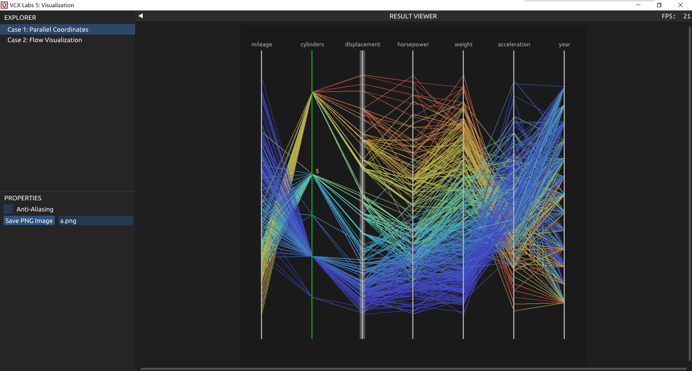
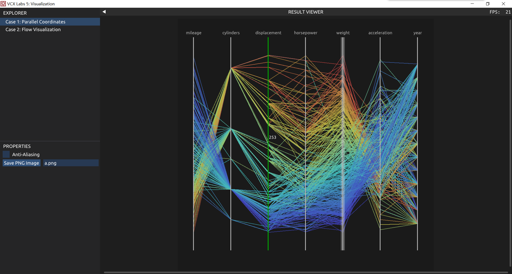

# VCX-lab5 报告

## Task 1: Parallel Coordinates Visualization

### 成果展示

**功能**：

1. 图像显示了车辆各属性之间的关系，每一条连线代表一辆车的数据，在轴上越高的位置代表该属性值越高
2. 每辆车的连线颜色代表某一个指定属性的大小，红色代表该属性值高，蓝色代表低。
3. 鼠标可以移动到某一个属性轴上面，该属性轴会显示为绿色
4. 鼠标移动到属性轴上时，会显示鼠标位置的刻度值
5. 鼠标点击某一个属性轴，该属性轴会标记为选定（连线颜色将以该属性为基准），选定属性会用白色透明框标记

上图可以看出年份越晚，displacement越低，因为year上半部分大多为蓝色。

上图中可以明显看出加速越慢的汽车，重量越大，因为weight和acceleration的连线明显在交叉。

### 实现细节

**初始化**：读入所有数据，用数组存起来，方便之后用下标访问。初始化Jet颜色映射表

**处理交互**：首先判断鼠标是否在画布内，然后读取鼠标位置，以及鼠标是否点击，检查其是否在某个属性轴上，作好标记。如果此时发现图片状态没有变化，则return false不再重复绘制。

**数据绘制**：枚举每一辆车，根据数据在属性轴取值范围的比值，计算点的位置，根据特定属性的数据读取比值根据Jet映射获取颜色，使用DrawLine绘制线。

**属性轴绘制**：如果发现标记了该属性轴为选定的，则先绘制一条粗的白色透明线，再绘制细的实线。制实线时，如果发现鼠标正停留在该轴上，则将实线绘制为绿色，并绘制数值文字。

