# 可视计算与交互概论 Tutorial for Lab 1 (2D Drawing)

## Lab 1 Overview

这次 Lab 中，大家将会实现前 8 讲中介绍的几种重要的算法或思想：

 1. 第四讲 图像处理 中的 Dithering 算法 （课件P15-P28）

 2. 第四讲 图像处理 中的 Image Filter 算法 （课件P36-P41）

 3. 第四讲 图像处理 中的 Poisson Editing 算法 （课件P42-P52）

 4. 第五讲 绘图 中的 Bresenham 直线算法 （课件P1-P15）
 
 5. 第五讲 绘图 中的 Scan Converting 三角形算法 （课件P18-P20）
 
 6. 第六讲 反走样 中的 Supersampling 算法
 
 7. 第八讲 曲线 中的 de Casteljau 算法

Lab1的任务比较多，但每个任务都不是很难。大家的任务是填补`Labs/1-Drawing2D/task.cpp`中的空缺部分，每一个函数对应一个任务。请务必**独立**完成自己的代码。下面分别介绍每个任务的目标。

## 评分

请提交实现完成的`task.cpp`文件，以及为本次lab写一份报告，包含实现的思路和结果。Lab按每个Task的完成情况单独给分。本次Lab一共需要实现11个函数，每个函数记1分，报告1分，总分12分。

## Task 1: Image Dithering (4')

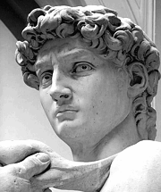

给定输入的灰色图像（RGB三通道的值相同），使用不同的算法实现图像的Dithering，输出图片只有全黑和全白两种颜色。每个算法的简要描述和结果如下：

### Threshold

灰度值在0.5以上的像素取1，灰度值在0.5以下的像素取0。实现在`void DitheringThreshold(ImageRGB & output, ImageRGB const & input)`函数里。这个函数作为API的参考提供给大家，不需要大家实现，最终输出如下：

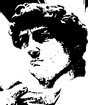

### Uniform Random

给每个像素加上$[-0.5, 0.5]$中均匀分布的随机扰动，然后使用Threshold算法。请实现`void DitheringRandomUniform(ImageRGB & output, ImageRGB const & input)`函数。目标输出如下：

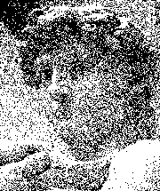

### Blue Noise Random

给每个像素加上蓝噪声的随机扰动，然后使用Threshold算法。蓝噪声的生成相对复杂，现在还是一个值得研究的问题（[Fast Poisson disk sampling in arbitrary dimensions](https://dl.acm.org/doi/10.1145/1278780.1278807)，[Blue-noise dithered sampling](https://dl.acm.org/doi/10.1145/2897839.2927430)）。我们提供了网络上的免费蓝噪声材质（[来源](http://momentsingraphics.de/BlueNoise.html)），感兴趣的同学也可以尝试自己生成：

请实现`void DitheringRandomBlueNoise(ImageRGB & output, ImageRGB const & input, ImageRGB const & noise)`函数。使用蓝噪声材质的结果如下：

### Ordered

使用3x3的有规律的黑白像素分布表示原图的一个灰度像素（课件P24），因此Dithering之后的图像宽高比之前大3倍。请实现`void DitheringOrdered(ImageRGB & output, ImageRGB const & input)`函数，目标输出如下：

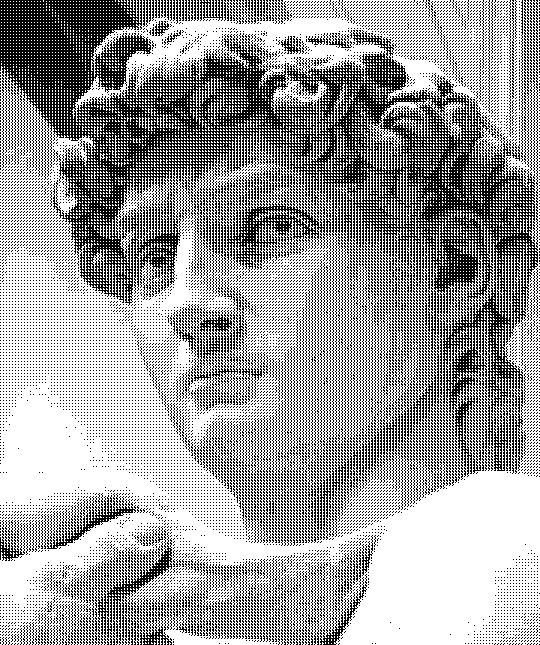

### Error Diffuse

用Floyd-Steinberg Error Diffusion算法（课件P27）实现Dithering。请实现`void DitheringErrorDiffuse(ImageRGB & output, ImageRGB const & input)`，目标输出如下：

## Task 2: Image Filtering (2')

使用3x3大小的Kernel实现两种效果，图像模糊：`void Blur(ImageRGB & output,ImageRGB const & input)`，图像边缘提取：`void Edge(ImageRGB & output, ImageRGB const & input)`。效果如下：

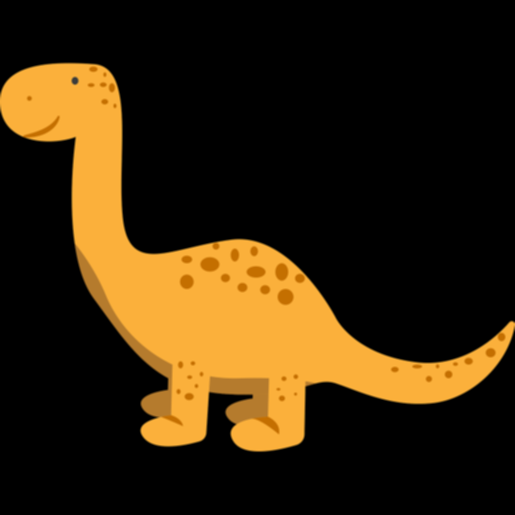
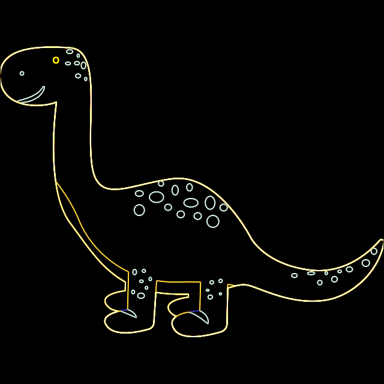

## Task 3: Image Inpainting (1')

使用Poisson Editing算法（P47-P52）将飞机图片贴到未名湖上空，补全`void Inpainting(ImageRGB & output, ImageRGB const & inputBack, ImageRGB const & inputFront, const glm::ivec2 & offset)`函数。直接粘贴的方式效果如下：

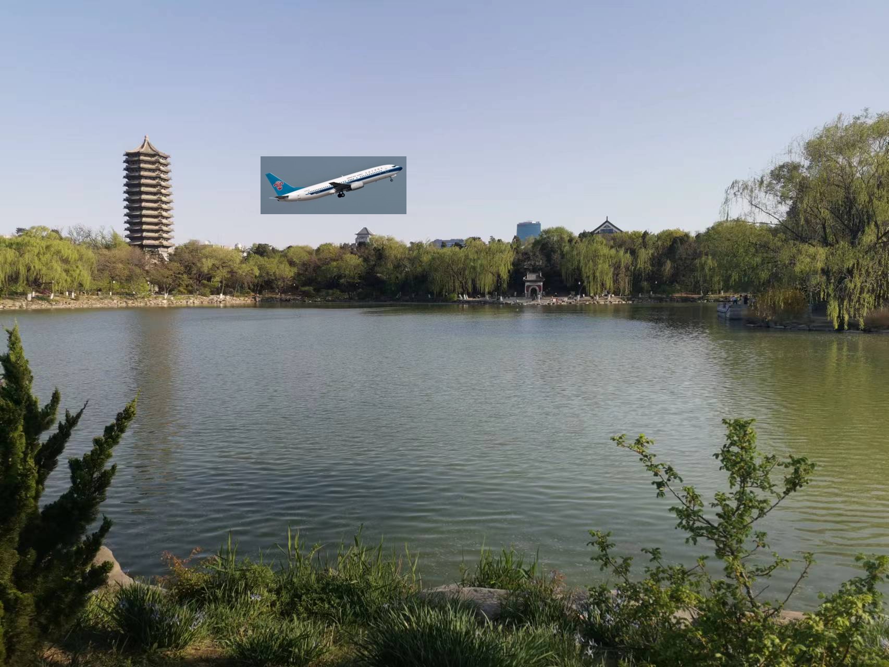

在使用了Poisson Editing算法之后（因为Jacobi迭代次数比较多可能比较慢）结果如下：

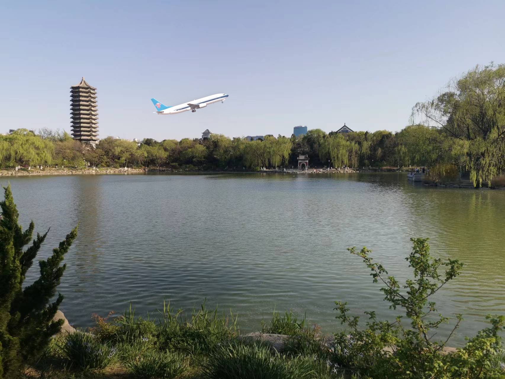

## Task 4: Line Drawing (1')

用Bresenham算法绘制直线，实现`void DrawLine(ImageRGB &       canvas, glm::vec3 const color, glm::ivec2 const p0, glm::ivec2 const p1)`函数。请注意需要实现各个斜率的情况，并注意代码的运行效率。实现结果如下图所示，并可以通过鼠标右键拖动两个端点：

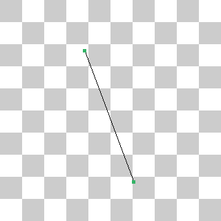

## Task 5: Triangle Drawing (1')

任意给定平面中的三个点，绘制以这三个点为顶点的实心三角形。可以参考这个[课件](https://www.cs.princeton.edu/courses/archive/fall00/cs426/lectures/scan/sld004.htm)。实现任意一种算法即可。感兴趣的同学可以实现不同的算法比较运算效率。需要实现`void DrawTriangleFilled(ImageRGB & canvas, glm::vec3 const color, glm::ivec2 const p0, glm::ivec2 const p1, glm::ivec2 const p2)`函数。实现结果如下所示，并可以自由拖动三角形的三个端点：

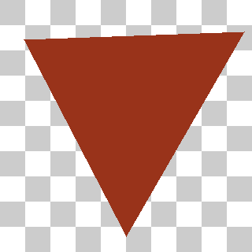

## Task 6: Image Supersampling (1')

将一个大图缩小时可能发生Aliasing的情况，如下图所示（注意图像中西装领口部分不自然的条纹）：

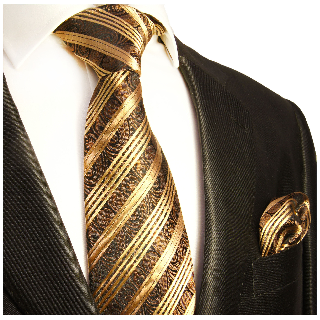

Aliasing可以通过提高每个目标像素的采样率来减轻，这就是反走样最简单的算法Super Sampling Anti-Aliasing（SSAA），下图展示了5倍超采样的结果：

可以看到不自然的条纹减少了很多，图像也没有变得很模糊。请实现`void Supersample(ImageRGB & output, ImageRGB const & input, int rate)`函数，`rate`控制超采样率，这样就能通过图像界面中的滑动条显示不同超采样率的结果。

> 如果你发现在1倍采样的时候依然没有观察到Aliasing的现象，可能是因为你使用了高分辨率屏幕。可以尝试改小`CaseSSAA.cpp`中的图像大小再观察。

## Task 7: Bezier Curve (1')

给定四个控制点，使用德卡斯特里奥算法(de Casteljau's algorithm)算法，计算出贝塞尔曲线上点的位置，最终在屏幕上画出一条曲线。需要实现`glm::vec2 CalculateBezierPoint(std::span<glm::vec2> points, float const t)` 。你可以在 `LabContext` 中自行更改控制点的数量，绘制出更高次的贝塞尔曲线。实现结果如下，跟之前一样可以拖动控制点的位置：

