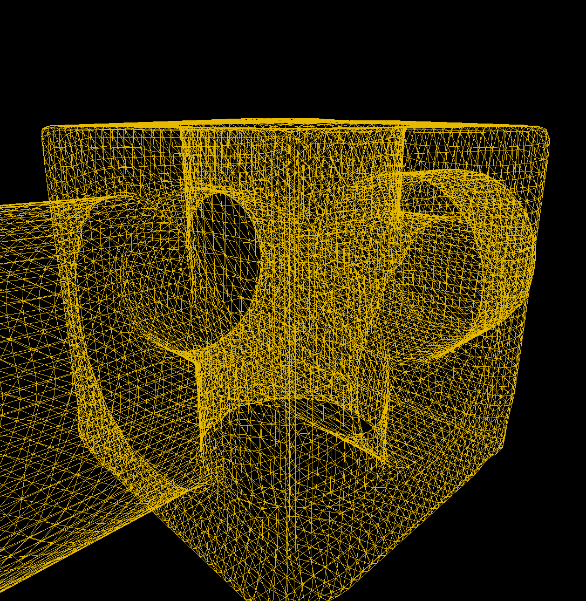
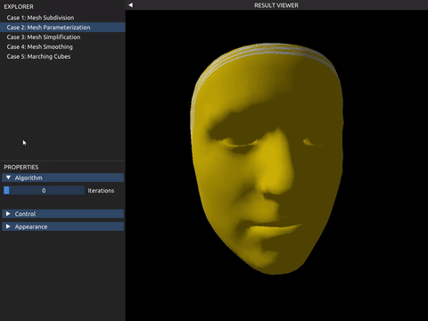
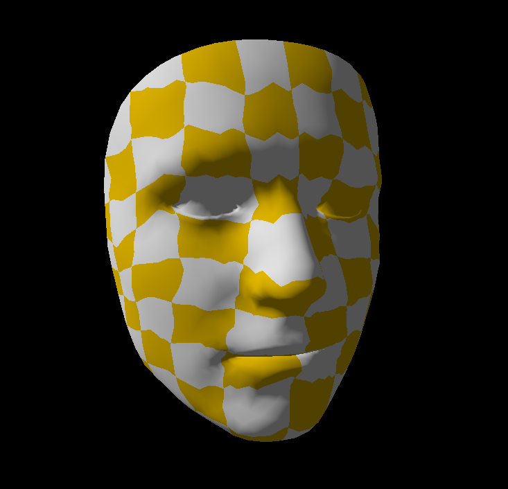
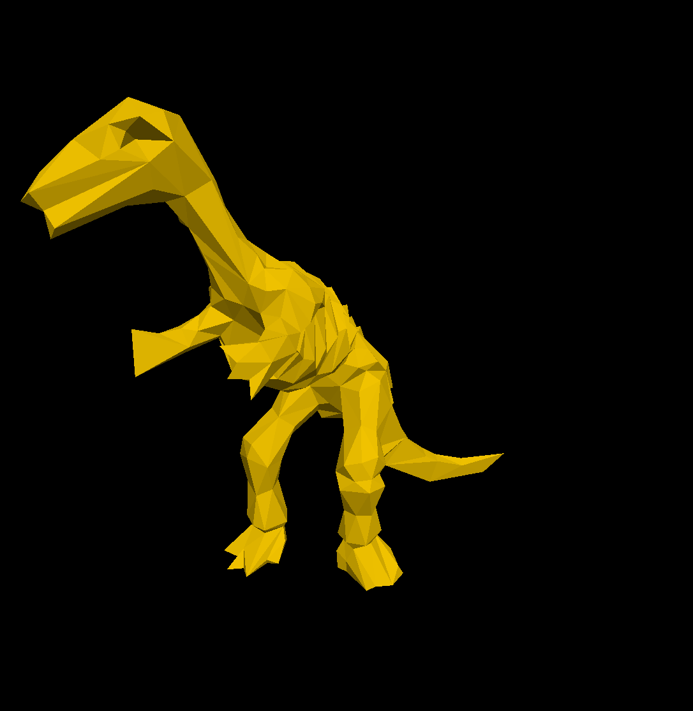
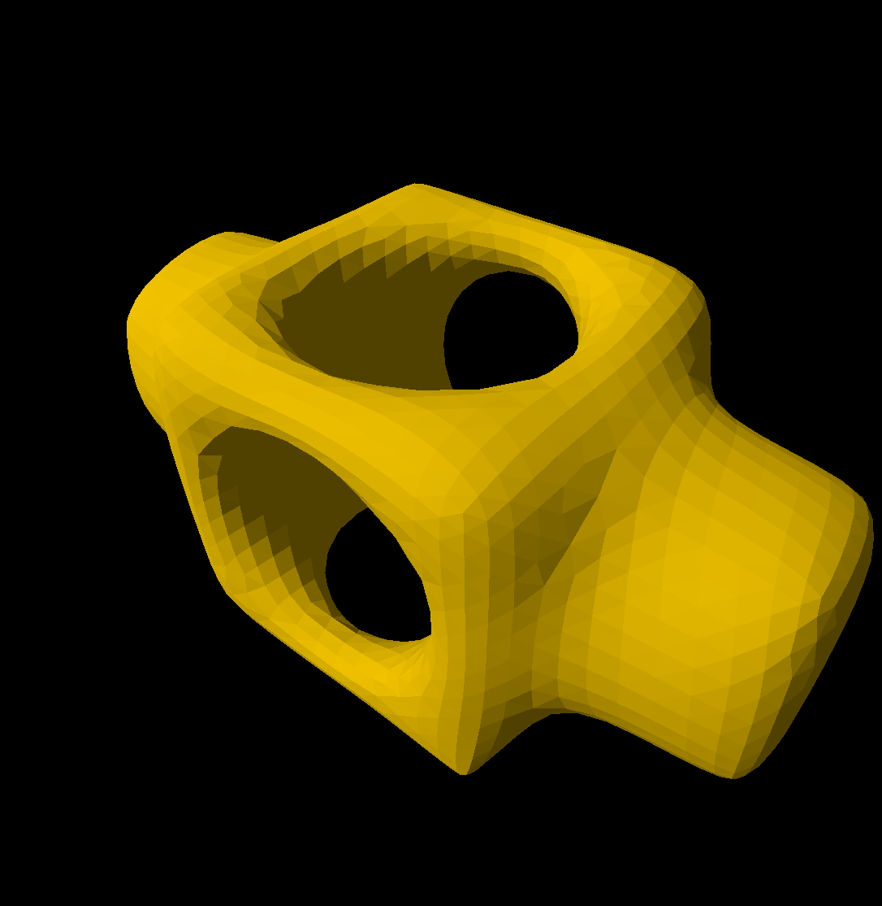
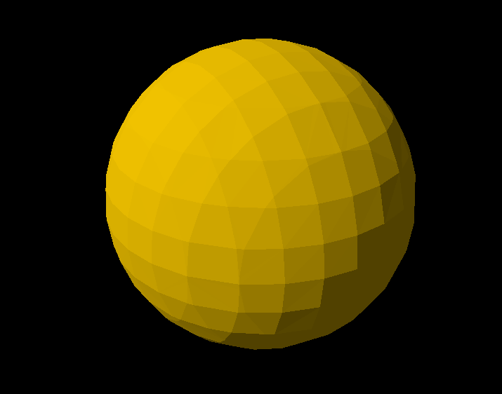
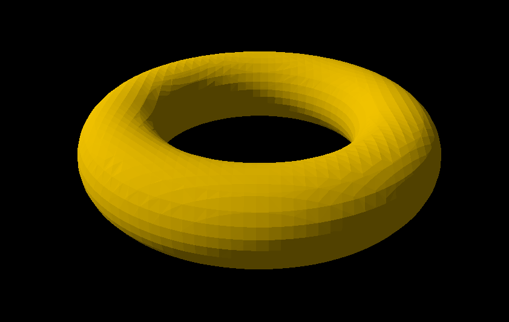
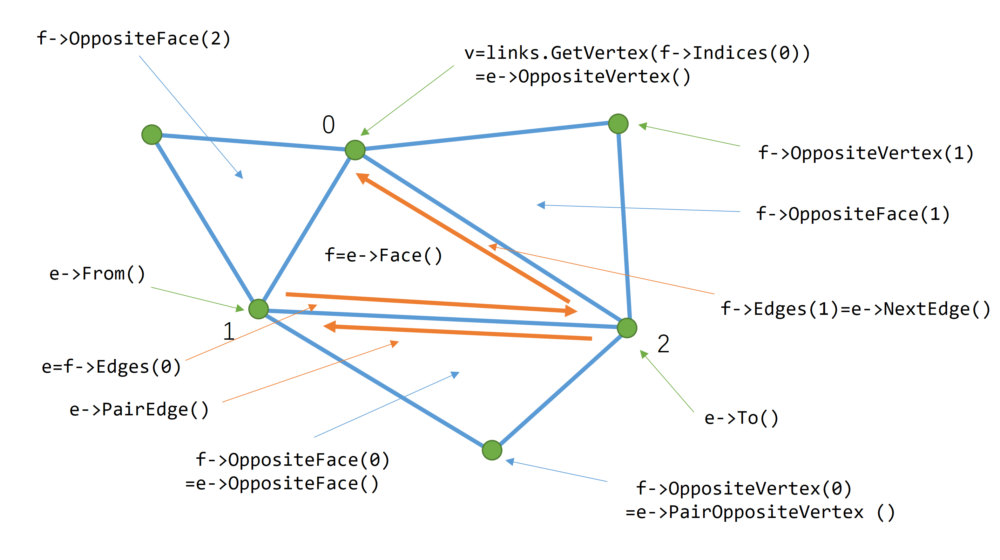

# 可视计算与交互概论 Tutorial for Lab 2 (Geometry Processing)

## Lab 2 Overview

这次 Lab 中，大家将会实现几何处理部分介绍的几种重要的算法或思想：

 1. 几何表示中的 Loop Mesh Subdivision 算法 （课件P30-P32）
 2. 几何表示中的 Spring-Mass Mesh Parameterization 算法 （课件P34-P45）
 3. 几何处理中的 Mesh Simplification 算法 （课件P14-P18）
 4. 几何处理中的 Mesh Smoothing 算法 （课件P39-P46）
 5. 几何重建中的 Marching Cubes 算法 （课件P39-P47）

Lab2的算法难度会比Lab1更高一些。大家的任务是填补`Labs/2-GeometryProcessing/tasks.cpp`中的空缺部分，每一个函数对应一个任务。请务必**独立**完成自己的代码。下面分别介绍每个任务的目标。

## 评分

请提交实现完成的 `tasks.cpp` 文件，以及为本次 lab 写一份报告，包含实现的思路和结果。Lab 按每个 Task 的完成情况单独给分。本次 lab 总分 12 分，Task 1、2、4、5 每个 2 分，Task 3 占 3 分，报告占 1 分，总分 12 分。

## Task 1: Loop Mesh Subdivision (2')

请理解并实现课件中介绍的三角网格细分算法。算法来自于论文 [Smooth Subdivision Surfaces Based on Triangles](https://www.microsoft.com/en-us/research/wp-content/uploads/2016/02/thesis-10.pdf)（1987 年 Charles Teorell Loop 的硕士论文）。你需要实现`void SubdivisionMesh(Engine::SurfaceMesh const & input, Engine::SurfaceMesh & output, std::uint32_t numIterations)`函数，其中，`input` 和 `output` 分别为算法输入的网格和输出的网格，`numIterations`是细分操作迭代的次数。一次细分操作将在三角形网格每条边上产生一个新的顶点，如此将每一个三角形分割成更小的四个子三角形。新产生的顶点和原有的顶点将按照一定规则重新计算位置。大致算法流程如下：

1. 为当前 Mesh 建立查询边的数据结构（例如双向边链表，[DCEL](https://en.wikipedia.org/wiki/Doubly_connected_edge_list)，如果你希望使用我们提供的工具，请参见附录）
2. 对于原有的每个顶点，将它们加入到新 Mesh 中，在新 Mesh 中重新计算它们的位置
3. 遍历原有的每一条边，在边上产生新的顶点，计算它们的位置，并在新 Mesh 中连接顶点，形成新的面
4. 重复1-3步，直到迭代次数达到上限

算法实现的结果如下（这是 block.obj 迭代一次的结果），将产生均匀而光滑的细分表面。



## Task 2: Spring-Mass Mesh Parameterization (2')

请理解并实现课件中介绍的基于弹簧质点的三角网格参数化算法。算法的更详细的介绍可以参考 SIGGRAPH 2008 年的 Course: [Mesh parameterization: theory and practice](https://dl.acm.org/doi/pdf/10.1145/1508044.1508091) 中的第二章。你需要实现`void Parameterization(Engine::SurfaceMesh const & input, Engine::SurfaceMesh & output, const std::uint32_t numIterations)`函数，其中`numIterations`是求解矩阵方程的迭代次数，输出的 `output` Mesh 的 TexCoords 应该保存每个顶点的 UV 坐标，需要保证在$[0, 1]^2$之内。这里我们提供算法的大概流程供大家参考：

1. 为当前 `input` Mesh 建立查询边的数据结构，检查网格上的边界点（具体来说，只和一个三角形面相交的边，其两个端点被称为边界点）
2. 初始化边界点上的 UV 坐标，可以选择初始化为正方形边界或者为圆边界
3. 迭代求解中间点上的 UV 坐标，简单起见可以使用 $\lambda_{ij}=1/n_i$ 的平均权重，并可以参考 Lab1 中 Poisson Editing 部分如何使用 Jacobi 迭代求解矩阵方程

算法实现的结果如下，在迭代到足够多步后 UV 坐标收敛，并且相对均匀地分布在人脸上。





## Task 3: Mesh Simplification (3')

请理解并实现课件中介绍的网格简化算法。算法来自于论文 [Surface Simplification Using Quadric Error Metrics](https://people.eecs.berkeley.edu/~jrs/meshpapers/GarlandHeckbert2.pdf) 。你需要实现`void SimplifyMesh(Engine::SurfaceMesh const & input, Engine::SurfaceMesh & output, float valid_pair_threshold, float simplification_ratio)`函数，其中，`input` 和 `output` 分别为算法输入的网格和输出的网格，`valid_pair_threshold`是论文3.2节中介绍的 threshold parameter $t$，`simplification_ratio`是该简化算法保留顶点的比例 $(\in [0,1])$ 。论文4.1节给出了大致的算法流程（考虑到维护最小堆非常麻烦，我们简化了第四步和第五步）：

1. 为每个初始顶点计算二次代价矩阵 $Q_i$
2. 按照特定规则，选择所有合法的顶点对
3. 对于每一个顶点对 $\text{v}_i, \text{v}_j$，求解最优的收缩点 $\bar{\text{v}}$ ，并计算它的代价 $\bar{\text{v}}^T(Q_i+Q_j)\bar{\text{v}}$
4. （不再维护一个最小堆，而是）迭代地从顶点对中找出代价最小的那一对进行顶点合并，直到剩余顶点的数量小于所需的比例

具体实现中，你可能会需要求矩阵的逆，由于这里只涉及四阶方阵，GLM直接提供了 `glm::inverse` 方法，只需要包含头文件 `#include <glm/gtc/matrix_inverse.hpp>` 。

算法实现的结果如下。



## Task 4: Mesh Smoothing (2')

请理解并实现课件中介绍的网格平滑算法。算法是经典的 [Laplacian Smoothing](https://en.wikipedia.org/wiki/Laplacian_smoothing) 。你需要实现`void SmoothMesh(Engine::SurfaceMesh const & input, Engine::SurfaceMesh & output, std::uint32_t numIterations, float lambda, bool useUniformWeight)`函数，其中，`input` 和 `output` 分别为算法输入的网格和输出的网格，`numIterations`是平滑的迭代次数，`lambda`是控制平滑率的参数，`useUniformWeight`决定是否使用 Uniform Laplacian（否则使用 Cotangent Laplacian）。算法大致流程如下：

1. 对每个顶点 $v_i$ ，计算邻居位置的加权平均
   $$v_i^*=\frac{\sum_{j\in N(i)}w_{ij} v_j}{\sum_{j\in N(i)} w_{ij}}$$
2. 其中使用 Uniform Laplacian 时 $w_{ij}=1$ ；使用 Cotangent Laplacian 时 $w_{ij}=\cot \alpha_{ij} + \cot \beta_{ij}$
3. 更新顶点：$v_i=(1-\lambda)v_i+\lambda v_i^*$
4. 重复1-3步，直到迭代次数达到上限
   


算法实现的结果如下。



## Task 5: Marching Cubes (2')

请理解并实现 Marching Cubes 算法将隐式表面转化为显式 Mesh 表示。你需要实现`void MarchingCubes(Engine::SurfaceMesh & output, const std::function<float(const glm::vec3 &)> & sdf, const glm::vec3 & grid_min, const float dx, const int n)`函数，各个参数的含义如下：

* `Engine::SurfaceMesh & output`: 输出的 Mesh
* `const std::function<float(const glm::vec3 &)> & sdf`: 隐式几何有符号距离场的函数，对于空间中的任意位置 `glm::vec3 pos`，可以调用 `sdf(pos)` 得到该点到隐式表面的有符号距离
* `const glm::vec3 & grid_min`, `const float dx`, `const int n`: 这三个参数定义了以 `grid_min` 为起始点，每个格子长度为 `dx`，XYZ 三个方向都向正方向延申 n 个格子的背景网格

考虑到大家实现的方便，我们提供了 Marching Cubes 所需的两个表格：`c_EdgeStateTable` 和 `c_EdgeOrdsTable` 在 `marching_cubes_table.h` 中，可以在 `tasks.cpp` 中直接使用。我们规定每个网格顶点和边的顺序如下：


在这样的约定中，我们可以通过位运算得到每个顶点的位置。假设立方体 $v_0$ 顶点的位置为 $v_0 = (x, y, z)$，则第 $i$ 个顶点 $v_i$ 的位置为 

$$v_i = (x + (\text{i \& 1})\cdot dx, y + (\text{i >> 1 \& 1})\cdot dx, z + (\text{i >> 2 \& 1})\cdot dx)$$

第 $j$ 条边 $e_j$ 的方向为 

$$unit(\text{j >> 2})$$

其中 $unit()$ 表示第几个方向的基矢，$unit(0) = (1, 0, 0)$，$unit(1) = (0, 1, 0)$，$unit(2) = (0, 0, 1)$。第 $j$ 条边的起始点为 

$$v_0 + dx \cdot (\text{i \& 1}) \cdot unit(\text{((j >> 2) + 1) \% 3}) + dx \cdot (\text{i >> 1 \& 1}) \cdot unit(\text{((j >> 2) + 2) \% 3})$$

这个顺序与表中的顺序对应，比如查询`c_EdgeStateTable`时，`uint32_t e = c_EdgeStateTable[v];` 中 `v` 的第 i 位记录了第 i 个顶点的信息，`e` 的第 j 位记录了第 j 条边的信息。

我们提供了球和环形的隐式表面，算法的生成结果如下，你也可以尝试自己定义隐式表面进行可视化：






## 附录

我们提供了一份DCEL数据结构的实现（在 `DCEL.hpp` 中），具体来说用法如下：

```cpp
#include "Labs/2-GeometryProcessing/DCEL.hpp"

namespace VCX::Labs::GeometryProcessing {

    void Something(Engine::SurfaceMesh const & input) {
        DCEL links;
        links.AddFaces(input.indices); // initialize
        if (! links.IsValid()) {
            // we check if the mesh is valid
        }

        // for each vertex
        for (std::size_t i = 0; i < input.Positions.size(); ++i) {
            DCEL::Vertex v = links.GetVertex(i); // get vertex with index i
            // do something with v
        }

        // for each edge
        for (DCEL::HalfEdge const * e : links.GetEdges()) {
            // do something with e
        }
    }

}

```

对于 `DCEL links` ：
+ `AddFaces(faces)` ：使用网格的面索引初始化
+ `links.GetVertex(idx)` ：根据顶点的索引获取相应的 `Vertex` 数据结构以便进一步查询（这些索引与初始化时绑定的面索引一一对应）
+ `links.GetFaces()` ：获取所有的面（ `Triangle const *` ），以便进一步查询（这些面的顺序与初始化时传入的一致）
+ `links.GetEdges()` ：获取所有的边（ `HalfEdge const *` ），以便进一步查询
+ `links.IndexOf(face)` ：获取某个面（ `Triangle const *` ）在所有面中的顺序（从0开始计数）

对于 `DCEL::Vertex v` ：
+ `v.IsSide()` ：是否是边界上的点
+ `v.GetSideNeighbors()` ：如果是边界点，这个方法返回它邻居顶点中，其他两个边界点的索引
  + 在一个合法的网格中，一个边界点有且只有两个相邻顶点也是边界点
+ `v.GetNeighbors()` ：返回所有邻居顶点的索引
+ `v.GetFaces()` ：返回所有相邻的面

对于 `DCEL::Triangle const * f` ：
+ `f->Indices(i)` ：返回第 `i` 个顶点的索引（`i`=0,1,2），这里的顶点顺序和初始化时传入的一致
+ `f->Edges(i)` ：返回第 `i` 条边的半边结构（`i`=0,1,2），保证顶点 `i` 的对边就是边 `i`
+ `f->OppositeFace(i)` ：返回一个相邻的面，这个面与面 `f` 的共边就是边 `i`（请先检查这个面存在）
+ `f->HasOppositeFace(i)` ：检查一个相邻的面是否存在，这个面与面 `f` 的共边就是边 `i`
+ `f->IndiceOfVertex(idx)` ：根据顶点索引，返回这个顶点在面中 `f` 的序号（0,1,2）
+ `f->HasVertex(idx)` ：根据顶点索引，检查这个顶点是否在面中
+ `f->OppositeVertex(i)` ：返回一个相邻的面上某个顶点的索引，保证：
  + 这个面与面 `f` 的共边就是边 `i`
  + 返回的顶点不在边 `i` 上

对于 `DCEL::HalfEdge const * e` ：
+ `e->To()` ：这条半边指向的顶点的索引
+ `e->From()` ：这条半边起点的索引
+ `e->NextEdge()` ：沿着同样方向的下一条半边（它的起点就是半边 `e` 指向的顶点）
+ `e->PrevEdge()` ：沿着同样方向的上一条半边（它指向半边 `e` 的起点）
+ `e->PairEdge()` ：和这条半边方向相反的半边（请先检查这个半边存在）
+ `e->OppositeVertex()` ：`e` 所在的面上，与 `e` 不相交的那个顶点的序号
+ `e->Face()` ：半边所在的面结构
+ `e->OppositeFace()` ：`e->PairEdge()` 所在的面结构
+ `e->PairOppositeVertex()` ：`e->PairEdge()` 所在的面上，与 `e->PairEdge()` 不相交的那个顶点的序号


