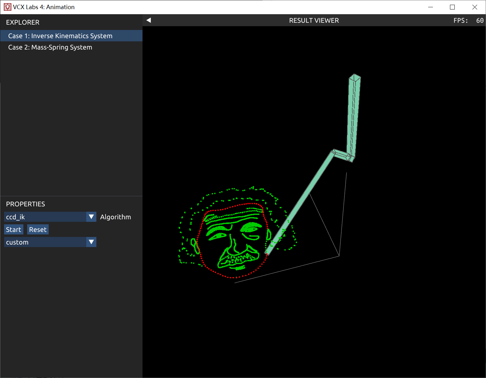
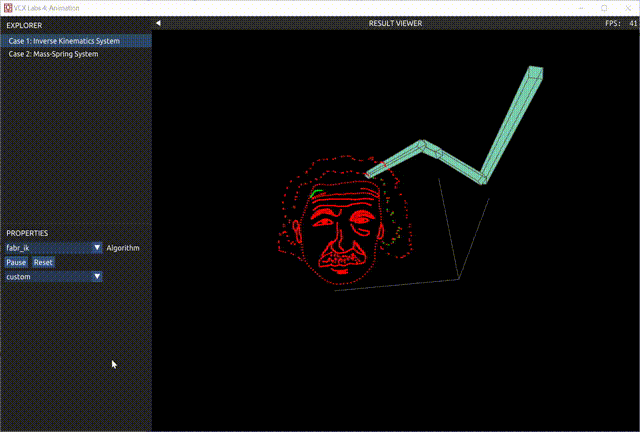
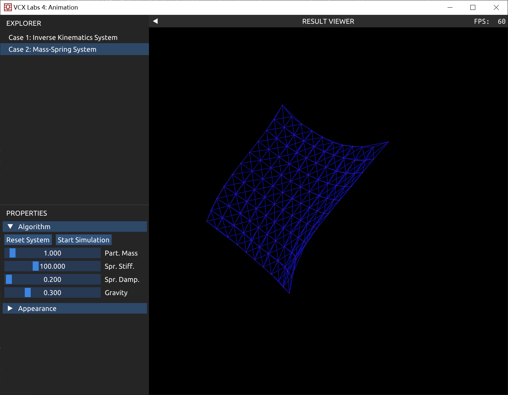

# 可视计算与交互概论 Tutorial for Lab 4 (Animation)

## Lab 4 Overview

这次 Lab 中，大家将要完成两种动画生成的算法：

1. 使用逆向运动学 (Inverse Kinematics) 生成机械臂动画（课件《动画原理》P21-P38）
2. 实现隐式弹簧质点系统 (Mass-Spring System) 生成布料动画（课件《物理模拟》P10-P31）

## 评分

请提交实现完成的 `tasks.cpp` 文件，以及为本次 lab 写一份报告，包含实现的思路和结果。Lab 按每个 Task 的完成情况单独给分。本次 lab 总分 11 分，Task 1 占 5 分，Task 2 占 5 分，报告占 1 分。

## Task 1: Inverse Kinematics (5')

### 代码说明

作业预期结果如图所示。

逆向运动学：给定一个机械臂末端位置，求解出每个关节的旋转角度。代码框架中，使用四元数进行旋转操作。
可以通过 Eigen 或 glm 库进行数学运算（旋转，向量运算等）。

- JointLocalOffset：表示一个关节相对于父关节的平移量
- JointOffset[0]：表示根关节(root)的全局位置
- JointOffsetLength：表示每个关节的长度
- JointLocalRotation：表示每个关节的局部旋转
- JointGlobalRotation：表示每个关节的全局旋转
- JointGlobalPosition：表示每个关节的全局位置
- EndPositionHistory：表示末端关节的位置序列
- TargetPositionList：表示末端关节应当做出的位置序列; 

### Sub-Task 1:
实现前向运动学 (forward kinematic) 算法。程序入口在tasks.cpp中ForwardKinematics 函数。输入是根节点的位置，每个关节相对于父关节的偏移量。输出是每个关节在世界坐标系下的位置和旋转。

### Sub-Task 2:
实现 CCD IK 算法。程序入口在tasks.cpp中 InverseKinematicsCCD 函数。输入是末端的目标位置，输出是每个关节的旋转。

### Sub-Task 3:
实现 FABR IK 算法。程序入口在tasks.cpp中InverseKinematicsFABR 函数。输入是末端的目标位置，输出是每个关节的旋转。

### Sub-Task 4:
使用 IK 绘制自定义曲线。程序入口在tasks.cpp中BuildCustomTargetPosition()函数。
修改这个函数，自定义绘制曲线（比如数字，姓名首字母缩写等）。

#### Sub-Task 4.1 (选做)
在通过函数生成轨迹时，会出现采样点不均匀的地方。比如在这个图里，头像的头发非常稀疏。有无可能让采样点更加均匀？

#### Sub-Task 4.2 (选做)
输入一张简单的 2D 图像（比如 MNIST 手写数字），提取图像的骨架，作为 IK 的目标轨迹。

在阅读和补全代码的过程中，请在报告中回答下面的问题：

1. 如果目标位置太远，无法到达，IK 结果会怎样？
2. 比较 CCD IK 和 FABR IK 所需要的迭代次数。
3. （选做，只提供大概想法即可）由于 IK 是多解问题，在个别情况下，会出现前后两帧关节旋转抖动的情况。怎样避免或是缓解这种情况？

## Task 2: Mass-Spring System (5')

`task.cpp` 中已经实现了一个显式 Euler 的弹簧质点系统。该方法的稳定性很差。为了达到稳定实时模拟的要求，你需要将它改写为隐式 Euler。最终实现的单帧效果如下（一面在重力作用下飘动的布料）：

Hint: 可使用 Eigen 库进行稀疏线性系统求解。参考 https://eigen.tuxfamily.org/dox/group__Sparse__chapter.html