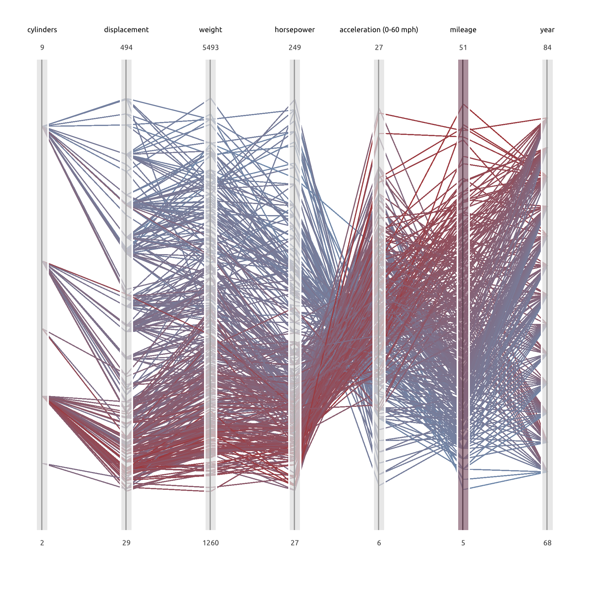
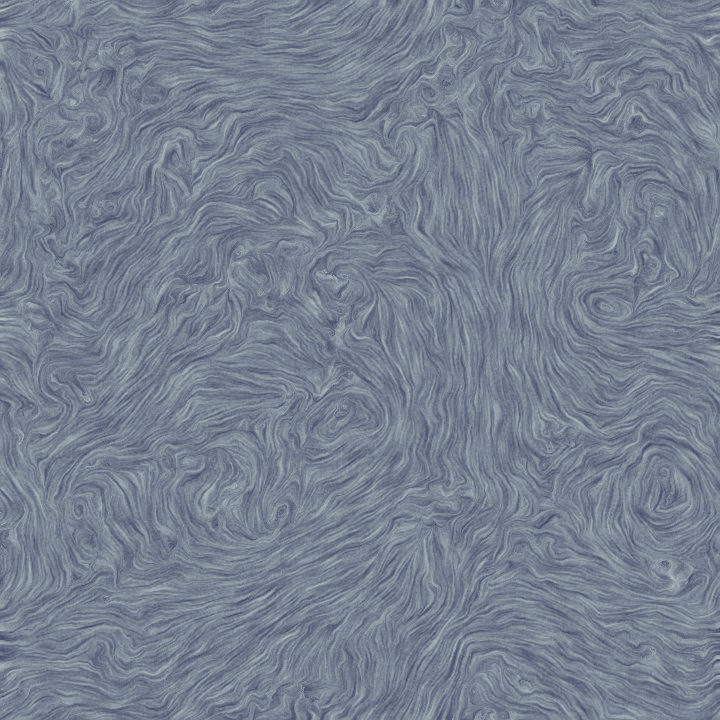

# 可视计算与交互概论 Tutorial for Lab 5 (Visualization)

## Lab 5 Overview

这次 Lab 中，大家将要完成两项可视化任务：

1. 使用Parallel Coordinates对多维数据进行可视化（信息可视化基础课件P37-P50）
2. 使用LIC算法进行二维流场可视化

大家的任务是填补 `Labs/5-Visualization/tasks.cpp` 中的空缺部分，每一个函数对应一个任务。请务必**独立**完成自己的代码。下面分别介绍每个任务的目标。

## 评分

请提交实现完成的 `tasks.cpp` 文件，以及为本次 lab 写一份报告，包含实现的思路和结果。Lab 按每个 Task 的完成情况单独给分。本次 lab 总分 5 分，Task 1 占 4 分，Task 2 为选做不计分，报告占 1 分。

## Task 1: Parallel Coordinates Visualization (4')

请理解并实现[Parallel Coordinates](https://en.wikipedia.org/wiki/Parallel_coordinates)的可视化，效果参考如下：



你需要实现 `bool PaintParallelCoordinates(Common::ImageRGB & input, InteractProxy const & proxy, std::vector<Car> const & data, bool force)` 函数，其中，`input` 是用于绘制的RGB画布，`proxy` 是用于鼠标交互的代理，`data` 是需要可视化的数据，`force` 参数用于性能优化。下面对每个参数进行详细解释：

### input

+ `input` 是用于绘制的画布，`PaintParallelCoordinates` 函数会在每一帧被调用，除了第一次传入的 `input` 是RGB值未知的空画布，其余情况下，传入的 `input` 的内容就是上一帧完成绘制时的内容。`input` 将会有确定的宽度和高度（每一次传入时，它们都是不变的，另外，你可以通过 `input.GetSizeX()` 和 `input.GetSizeY()` 来得到宽度和高度）。

+ 你可以使用 `input.At(x, y) = glm::vec3(r, g, b);` 来对特定位置的像素绘制特定颜色。我们也提供了一些简单封装的绘图函数，你可以在 `Labs/5-Visualization/Data.h` 找到它们的声明，在 `Labs/5-Visualization/Data.cpp` 找到它们的定义。如果有修改API的需要，你可以在task.cpp中任意拷贝这些绘图函数，然后修改得到你需要的版本。这些绘图函数是：

  + `void SetBackGround(Common::ImageRGB & canvas, glm::vec4 color)`

    将 `canvas` 用 `color` 填充。`color` 具有RGBA的类型，仅仅是为了保持和其他API的一致；这个函数实际上将忽略Alpha不透明度。
  + `void DrawLine(Common::ImageRGB & canvas, glm::vec4 color, glm::vec2 from, glm::vec2 to, float width)`
  
    绘制一条线段，从 `from` 到 `to` ，颜色为 `color` ，线段宽度为 `width` （像素）。`from` 和 `to` 是百分比坐标，即，其中的值应当在0和1之间。按照惯例，画布左上角为 $(0,0)$ ，右上角为 $(1,0)$ ，左下角为 $(0,1)$ ，右下角为 $(1,1)$ 。当然，任何绘图函数都支持你给百分比坐标赋值为 $[0,1]$ 以外的值（因此不必考虑超出画布边界的问题），但仍然只有落在画布内的部分是有效的。
  + `void DrawRect(Common::ImageRGB & canvas, glm::vec4 color, glm::vec2 leftTop, glm::vec2 size, float width)`
  
    绘制一个矩形轮廓，矩形左上角位置为 `leftTop` （百分比坐标），矩形宽长为 `size` （百分比坐标），轮廓宽度为 `width` （像素），颜色为 `color` 。
  + `void DrawFilledRect(Common::ImageRGB & canvas, glm::vec4 color, glm::vec2 leftTop, glm::vec2 size)`
  
    绘制一个矩形，矩形左上角位置为 `leftTop` （百分比坐标），矩形宽长为 `size` （百分比），填充颜色为 `color` 。
  + `void DrawCircle(Common::ImageRGB & canvas, glm::vec4 color, glm::vec2 origin, float radius, float width)`
    
    绘制一个圆形轮廓，圆形中心位置为 `origin` （百分比坐标），半径为 `radius` （百分比），轮廓宽度为 `width` （像素），颜色为 `color` 。
  + `void DrawFilledCircle(Common::ImageRGB & canvas, glm::vec4 color, glm::vec2 origin, float radius)`
    
    绘制一个圆形，圆形中心位置为 `origin` （百分比坐标），半径为 `radius` （百分比），填充颜色为 `color` 。
  + `bool PrintText(Common::ImageRGB & canvas, glm::vec4 color, glm::vec2 pos, float lineHeight, std::string const & caption)`
    
    绘制文本，文本中心位置为 `pos` （百分比坐标），行高为 `lineHeight` ，颜色为 `color` ，文本内容为 `caption` 。注意，文本为默认字体，且不会换行、不能绘制中文字符。当绘制的文本含有无法绘制的字符时，函数返回 `false` ，否则返回 `true` 。


### proxy

+ `proxy` 是鼠标交互的代理，你可以在 `PaintParallelCoordinates` 函数中通过调用它的成员函数来获得鼠标交互的信息。当然，交互对可视化并不是必须的，理论上你可以选择不实现交互。具体来说，`proxy` 提供了这些方法（你可以在 `Labs/5-Visualization/Data.h` 找到它们的声明，在 `Labs/5-Visualization/Data.cpp` 找到它们的定义）：

  + `glm::vec2 MousePos() const`
    
    获得鼠标相对于画布的位置（百分比坐标）。坐标的值可能超出 $[0,1]$ ，表示在画布之外。
  + `glm::vec2 MouseDeltaPos() const`
    
    获得鼠标相对于上一帧移动的距离（百分比）。例如返回 $(0.3,0.0)$ 表示鼠标向右移动了画布宽度30%的距离。
  + `bool IsHovering() const`
    
    当且仅当鼠标在画布内，返回 `true` 。注意，除了这个函数以外的任何其他函数都不关心鼠标是否在画布内。
  + `bool IsClicking(bool left = true) const`
    
    当且仅当鼠标进行了单击（在同一个位置进行按下和释放），返回 `true` 。参数 `left` 指示是否返回鼠标左键的状态（否则返回鼠标右键的状态）。
  + `bool IsDragging(bool left = true) const`
    
    当且仅当鼠标正在拖动（按下并且移动），返回 `true` 。参数 `left` 指示是否返回鼠标左键的状态（否则返回鼠标右键的状态）。

  + `glm::vec2 DraggingStartPoint(bool left = true) const`

    返回鼠标上一次按下时的位置（百分比坐标）。例如当 `IsDragging(...)` 为 `true` 时，`DraggingStartPoint(...)` 就是鼠标拖动的起始位置。参数 `left` 指示是否返回鼠标左键的状态（否则返回鼠标右键的状态）。

### data

+ `data` 是需要可视化的数据，它具有 `std::vector<Car>` 的类型，即，每一条数据具有 `Car` 的类型。你可以在 `Labs/5-Visualization/Data.h` 找到 `Car` 类型的定义。它有七个字段：

  + mileage：每加仑燃油行驶的英里数
  + cylinders：气缸数量
  + displacement：排量（平方英寸）
  + horsepower：功率（马力）
  + weight：重量（磅）
  + acceleration：0-60mph加速时间（秒）
  + year：生产年份


### return

+ 为了性能优化，`PaintParallelCoordinates` 函数可以通过返回 `false` 来拒绝重新绘制。例如，如果用户没有进行任何交互，我们就不必在每一帧都重新绘制，而只需要沿用上一帧的结果即可。因此，你可以在检测到画面没有任何变化时，通过提前返回 `false` 来跳过重新绘制。
+ 这个部分显然并不是必须的，当你发现无需性能优化时，可以选择始终在函数末尾返回 `true` 。


### force

+ `force` 参数指示 `PaintParallelCoordinates` 函数是否要强制进行重绘。当 `force` 为 `true` 的时候，意味着画布为空（例如第一次绘制）或者绘画参数改变（例如抗锯齿选项改变），此时，即使检测到画面没有任何变化，也必须进行重绘。
+ 显然，如果你选择始终在函数末尾返回 `true` ，就不需要处理 `force` 选项。


### 参考帮助

+ 1、如何在帧之间传递数据？

  可以设计一个状态类，然后在函数中声明静态对象：

  ```cpp
  struct CoordinateStates {
      // ...
  };

  bool PaintParallelCoordinates(...) {
      static CoordinateStates states(data); // initialize
      states.Update(proxy); // update according to user input
  }
  ```

+ 2、如何在函数中同时进行绘图和交互代理？

  ```cpp
  struct CoordinateStates {
      // ...
  };

  bool PaintParallelCoordinates(...) {
      static CoordinateStates states(data); // initialize
      bool change = states.Update(proxy); // update according to user input
      if (! force && ! change) return false; // determine to skip repainting
      states.Paint(input); // visualize
      return true;
  }
  ```

## Task 2: Flow Visualization (选做)

在这个任务中，我们使用 Line Integral Convolution (LIC) 算法进行2D流场的可视化，效果如下：



LIC 算法的原理可以参考这个链接：http://www.zhanpingliu.org/Research/FlowVis/LIC/LIC.htm ，你也可以参考这份 python 代码了解基本原理：https://github.com/dli7319/line-integral-convolution/blob/master/lic.py 。

请实现 `tasks.cpp` 中的 `void LIC(ImageRGB & output, Common::ImageRGB const & noise, VectorField2D const & field, int const & step)` 函数。其中 `output` 是输出的可视化图； `noise` 是 LIC 算法需要的背景噪声贴图； `field` 是流场的速度数据，其结构定义在 `CaseFlowVis.h` 中； `step` 控制 LIC 算法中沿流线卷积的长度，`step` 越大得到的流场可视化结果会越平滑。输入 `noise` 、`field` 保证大小一致，输出 `output` 也应该大小一样。